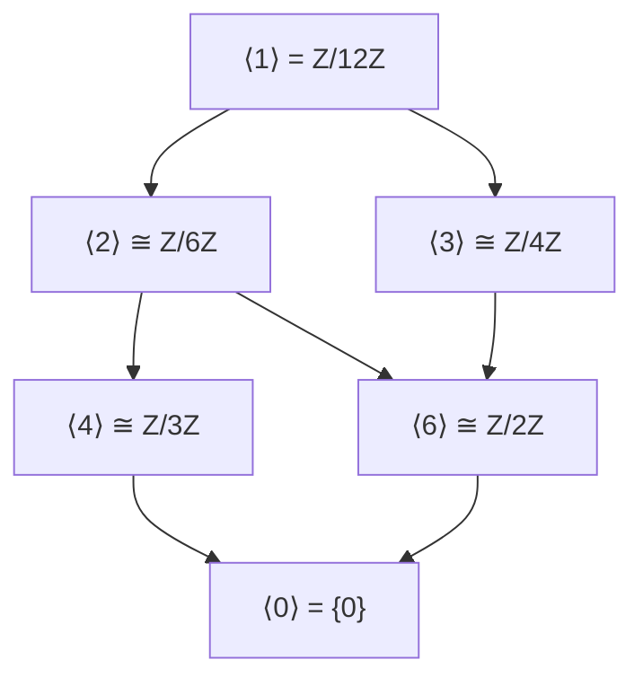

# Cyclic Groups

## Definition

> [!info] Definition (Cyclic Group)
> A group $G$ is **cyclic** if there exists an element $g \in G$ such that $G = \langle g \rangle$.
> The element $g$ is called a **generator** of $G$.

## Order of an Element

> [!info] Definition (Order)
> The **order** of an element $g \in G$, denoted $|g|$ or $\text{ord}(g)$, is the smallest positive integer $n$ such that $g^n = e$.
> If no such $n$ exists, $g$ has **infinite order**.

## Key Properties

1. **Cyclic groups are abelian**: $g^m g^n = g^{m+n} = g^n g^m$

2. **Classification**: Every cyclic group is isomorphic to either:
   - $\mathbb{Z}$ (infinite cyclic)
   - $\mathbb{Z}/n\mathbb{Z}$ (cyclic of order $n$)

3. **[[01 - Group Theory/Concepts/Subgroups|Subgroups]] of cyclic groups are cyclic**:
   - Subgroups of $\mathbb{Z}$: $n\mathbb{Z}$ for $n \geq 0$
   - Subgroups of $\mathbb{Z}/n\mathbb{Z}$: one for each divisor of $n$

4. **Number of generators**:
   - $\mathbb{Z}/n\mathbb{Z}$ has $\phi(n)$ generators (Euler's totient)
   - $a$ generates $\mathbb{Z}/n\mathbb{Z}$ iff $\gcd(a, n) = 1$

## Examples

> [!example] Example 1: $\mathbb{Z}/6\mathbb{Z}$
> Cyclic group of order 6.
> - Generators: $1, 5$ (since $\gcd(1,6) = \gcd(5,6) = 1$)
> - Subgroups: $\langle 0 \rangle$, $\langle 3 \rangle$, $\langle 2 \rangle$, $\langle 1 \rangle$
> - Lattice: corresponds to divisors of 6

> [!example] Example 2: $(\mathbb{Z}, +)$
> Infinite cyclic group.
> - Generators: $1$ and $-1$
> - Subgroups: $n\mathbb{Z}$ for each $n \geq 0$

> [!example] Example 3: Roots of Unity
> $\mu_n = \{e^{2\pi i k/n} : k = 0, 1, \ldots, n-1\}$
> - Cyclic group of order $n$ under multiplication
> - Generator: $\zeta_n = e^{2\pi i/n}$ (primitive $n$-th root of unity)

## Subgroup Lattice for $\mathbb{Z}/12\mathbb{Z}$

## Theorem: Subgroups of Cyclic Groups

> [!abstract] Theorem
> Let $G = \langle g \rangle$ be a cyclic group.
>
> **Case 1**: If $|G| = \infty$, then every subgroup has the form $\langle g^d \rangle$ for some $d \geq 0$.
>
> **Case 2**: If $|G| = n$, then:
> - For each divisor $d$ of $n$, there is exactly one subgroup of order $d$
> - This subgroup is $\langle g^{n/d} \rangle$

## Related Concepts

- [[01 - Group Theory/Concepts/Group Definition|Group Definition]]
- [[01 - Group Theory/Concepts/Subgroups|Subgroups]]
- [[01 - Group Theory/Concepts/Group Homomorphisms|Group Homomorphisms]]
