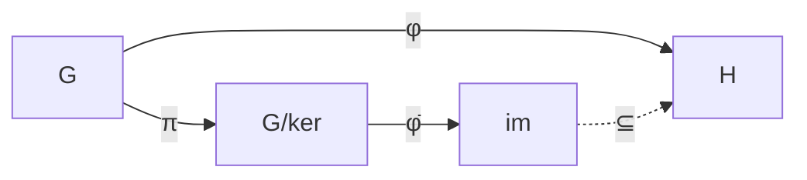
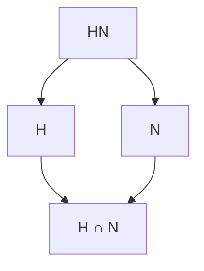

# Isomorphism Theorems

The isomorphism theorems are fundamental results connecting [[01 - Group Theory/Concepts/Group Homomorphisms|homomorphisms]], kernels, and quotient groups.

## First Isomorphism Theorem

> [!abstract] First Isomorphism Theorem
> If $\phi: G \to H$ is a [[01 - Group Theory/Concepts/Group Homomorphisms|homomorphism]], then:
> $$G / \ker(\phi) \cong \text{im}(\phi)$$
> The isomorphism is $\bar{\phi}: g \ker(\phi) \mapsto \phi(g)$.

## Second Isomorphism Theorem

> [!abstract] Second Isomorphism Theorem (Diamond Theorem)
> Let $H \leq G$ and $N \trianglelefteq G$. Then:
> 1. $HN \leq G$
> 2. $H \cap N \trianglelefteq H$
> 3. $HN/N \cong H/(H \cap N)$

## Third Isomorphism Theorem

> [!abstract] Third Isomorphism Theorem
> Let $N \trianglelefteq G$ and $K \trianglelefteq G$ with $N \subseteq K$. Then:
> 1. $K/N \trianglelefteq G/N$
> 2. $(G/N)/(K/N) \cong G/K$

> [!tip] Mnemonic
> "Cancel the $N$'s": $\frac{G/N}{K/N} \cong \frac{G}{K}$

## Fourth Isomorphism Theorem (Correspondence)

> [!abstract] Correspondence Theorem
> Let $N \trianglelefteq G$. There is a bijection:
> $$\{\text{subgroups of } G \text{ containing } N\} \longleftrightarrow \{\text{subgroups of } G/N\}$$
> given by $H \mapsto H/N$ with inverse $\bar{H} \mapsto \pi^{-1}(\bar{H})$.
>
> This preserves:
> - Inclusion order
> - Normality
> - Index

## Examples

> [!example] Example 1: $\det: GL_n(\mathbb{R}) \to \mathbb{R}^*$
> By First Isomorphism Theorem:
> $$GL_n(\mathbb{R}) / SL_n(\mathbb{R}) \cong \mathbb{R}^*$$

> [!example] Example 2: $\text{sgn}: S_n \to \{\pm 1\}$
> $$S_n / A_n \cong \mathbb{Z}/2\mathbb{Z}$$

> [!example] Example 3: Third Isomorphism Theorem
> $\mathbb{Z} \supset 2\mathbb{Z} \supset 6\mathbb{Z}$
> $$(\mathbb{Z}/6\mathbb{Z}) / (2\mathbb{Z}/6\mathbb{Z}) \cong \mathbb{Z}/2\mathbb{Z}$$

## Related Concepts

- [[01 - Group Theory/Concepts/Group Homomorphisms|Group Homomorphisms]]
- [[01 - Group Theory/Concepts/Normal Subgroups|Normal Subgroups]]
- [[01 - Group Theory/Concepts/Quotient Groups|Quotient Groups]]
- [[02 - Ring Theory/Concepts/Isomorphism Theorems for Rings|Isomorphism Theorems for Rings]]
