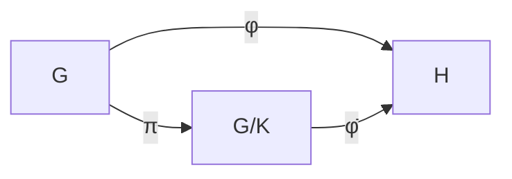

# Exercise G5: First Isomorphism Theorem

## Problem Statement

> [!question] Exercise
> Let $\phi: G \to H$ be a [[01 - Group Theory/Concepts/Group Homomorphisms|group homomorphism]]. Prove that:
> $$G / \ker(\phi) \cong \text{im}(\phi)$$

## Hints

> [!hint]- Hint 1
> First verify that $\ker(\phi)$ is a [[01 - Group Theory/Concepts/Normal Subgroups|normal subgroup]] of $G$.

> [!hint]- Hint 2
> Define $\bar{\phi}: G/\ker(\phi) \to H$ by $\bar{\phi}(g \cdot \ker(\phi)) = \phi(g)$.

> [!hint]- Hint 3
> Show $\bar{\phi}$ is well-defined, then prove it's a bijection onto $\text{im}(\phi)$.

## Solution

> [!success]- Solution
> ### Approach
> Construct an explicit isomorphism between the quotient and the image.
>
> ### Proof
> Let $K = \ker(\phi)$.
>
> **Step 1: $K \trianglelefteq G$.**
>
> For any $g \in G$ and $k \in K$:
> $$\phi(gkg^{-1}) = \phi(g)\phi(k)\phi(g^{-1}) = \phi(g) \cdot e_H \cdot \phi(g)^{-1} = e_H$$
> So $gkg^{-1} \in K$, hence $K \trianglelefteq G$.
>
> **Step 2: Define $\bar{\phi}: G/K \to H$.**
>
> Set $\bar{\phi}(gK) = \phi(g)$.
>
> **Step 3: $\bar{\phi}$ is well-defined.**
>
> If $gK = g'K$, then $g^{-1}g' \in K$, so $\phi(g^{-1}g') = e_H$.
> Thus $\phi(g)^{-1}\phi(g') = e_H$, giving $\phi(g) = \phi(g')$.
>
> **Step 4: $\bar{\phi}$ is a [[01 - Group Theory/Concepts/Group Homomorphisms|homomorphism]].**
>
> $\bar{\phi}(gK \cdot g'K) = \bar{\phi}(gg'K) = \phi(gg') = \phi(g)\phi(g') = \bar{\phi}(gK)\bar{\phi}(g'K)$
>
> **Step 5: $\bar{\phi}$ is injective.**
>
> $\bar{\phi}(gK) = e_H \Rightarrow \phi(g) = e_H \Rightarrow g \in K \Rightarrow gK = K$
>
> **Step 6: $\bar{\phi}$ maps onto $\text{im}(\phi)$.**
>
> For any $\phi(g) \in \text{im}(\phi)$, we have $\bar{\phi}(gK) = \phi(g)$.
>
> Therefore $G/K \cong \text{im}(\phi)$. $\square$

## Related Concepts

- [[01 - Group Theory/Concepts/Group Homomorphisms|Group Homomorphisms]]
- [[01 - Group Theory/Concepts/Normal Subgroups|Normal Subgroups]]
- [[01 - Group Theory/Concepts/Quotient Groups|Quotient Groups]]
- [[01 - Group Theory/Concepts/Isomorphism Theorems|Isomorphism Theorems]]

## Notes

This is arguably the most important theorem in group theory. It shows that every [[01 - Group Theory/Concepts/Group Homomorphisms|homomorphism]] naturally factors through a quotient.

