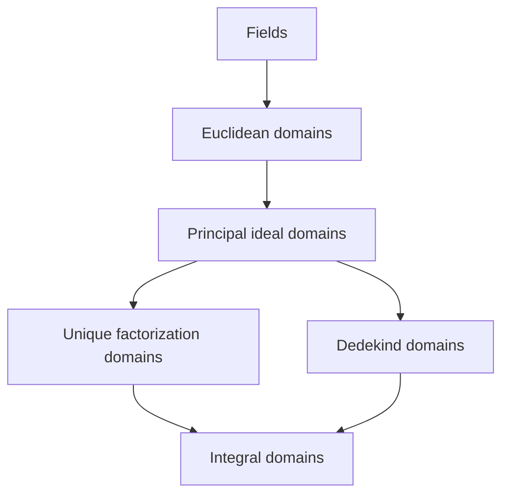

# Dedekind Rings and Fractional Ideals

## Definition

Let $\mathfrak o$ be a subring of a field $K$ whose quotient field is $K$.

> [!info] Fractional ideal
> A **fractional ideal** $\mathfrak a$ is a nonzero additive subgroup of $K$ such that
>
> $$
> \mathfrak o\mathfrak a\subseteq\mathfrak a
> $$
>
> and there is $0\ne c\in\mathfrak o$ with $c\mathfrak a\subseteq\mathfrak o$.

> [!info] Lang's Dedekind-ring definition
> The ring $\mathfrak o$ is a **Dedekind ring** if its nonzero fractional ideals form a group under ideal multiplication.

For a fractional ideal $\mathfrak a$, its inverse is

$$
\mathfrak a^{-1}
=\{x\in K:x\mathfrak a\subseteq\mathfrak o\},
$$

and the group property says $\mathfrak a\mathfrak a^{-1}=\mathfrak o$.

## Intuition

Element factorization may fail in a Dedekind ring, but nonzero ideals still factor uniquely into prime ideals. Fractional ideals allow denominators so that every nonzero ideal becomes invertible.

## Artin and Lang

> [!note] The same structure at two levels of generality
> Lang defines a Dedekind ring abstractly by invertibility of every nonzero fractional ideal. Artin's second edition does not introduce **Dedekind domain** as a named general ring class. Instead, Chapter 13 develops the same structure concretely for the ring of integers $R$ in an imaginary quadratic number field.

Artin's Main Lemma states that every nonzero ideal $A$ of such a ring satisfies

$$
A\overline A=(n)
$$

for some positive integer $n$. Hence

$$
A\left(\frac{1}{n}\overline A\right)=R,
$$

so $\frac{1}{n}\overline A$ is a fractional-ideal inverse of $A$. Thus Artin's quadratic-integer rings are Dedekind rings in Lang's sense, even though Artin does not use that name. Artin then proves unique factorization of nonzero ideals into prime ideals.

## Inclusion Hierarchy

> [!tip] Convention
> Every ring in this diagram is a commutative integral domain with identity. Under Lang's fractional-ideal definition, fields count as Dedekind rings. Authors who require a Dedekind domain to have Krull dimension exactly one exclude fields; that convention changes only the field endpoint, not the other implications below.



Every arrow runs from a narrower class to a broader class and means inclusion; it does not by itself assert that the adjacent inclusion is proper. Equivalently,

$$
\mathrm{Euclidean}\subseteq\mathrm{PID}\subseteq\mathrm{UFD},
\qquad
\mathrm{Euclidean}\subseteq\mathrm{PID}\subseteq\mathrm{Dedekind}.
$$

| Implication | Reason |
|---|---|
| Field $\Longrightarrow$ Euclidean domain | Division has remainder $0$. |
| Euclidean domain $\Longrightarrow$ PID | Choose a nonzero element of least Euclidean size in each nonzero ideal. |
| PID $\Longrightarrow$ UFD | In a PID, irreducible elements are prime and factorization terminates. |
| PID $\Longrightarrow$ Dedekind domain | Every nonzero fractional ideal is principal, hence invertible. |
| UFD or Dedekind domain $\Longrightarrow$ integral domain | Being a domain is part of both definitions used here. |

The two upper branches are not comparable:

- A UFD need not be Dedekind. The ring $\mathbb Z[x]$ is a UFD, but its nonzero prime ideal $(2)$ is not maximal because $\mathbb Z[x]/(2)\cong\mathbb F_2[x]$ is not a field.
- A Dedekind domain need not be a UFD. The ring $\mathbb Z[\sqrt{-5}]$ is Dedekind, but it has nonunique element factorization.

In fact, the intersection is exactly

$$
\mathrm{UFD}\cap\mathrm{Dedekind}=\mathrm{PID}.
$$

For the nontrivial direction, suppose that $R$ is both a UFD and Dedekind. If $P$ is a nonzero prime ideal, choose $0\ne a\in P$ and factor $a$ into irreducibles. Primality of $P$ puts some irreducible $\pi$ in $P$. In a UFD, $(\pi)$ is a nonzero prime ideal; in a Dedekind domain, both $(\pi)$ and $P$ are maximal. Therefore $(\pi)=P$. Every nonzero prime ideal is principal, and unique factorization of Dedekind ideals now makes every nonzero ideal principal.

## Key Properties

- Every nonzero ideal is finitely generated.
- Every nonzero ideal factors uniquely as a finite product of nonzero prime ideals.
- Every nonzero prime ideal is maximal.
- Localizing at a nonzero prime ideal gives a local principal ring whose nonzero ideals are powers of that prime.
- Ideal divisibility reverses inclusion:

$$
\mathfrak a\mid\mathfrak b
\quad\Longleftrightarrow\quad
\mathfrak b\subseteq\mathfrak a.
$$

- Principal fractional ideals form a subgroup, and the quotient is the ideal class group $\operatorname{Pic}(\mathfrak o)$.

## Examples

> [!example] Principal ideal domains
> Every principal ideal domain is Dedekind: each nonzero fractional ideal is generated by one element of the quotient field and is therefore invertible.

> [!example] Failure of element factorization
> The ring $\mathbb Z[\sqrt{-5}]$ is Dedekind but not factorial as an element ring. Ideal factorization repairs the nonuniqueness behind
>
> $$
> 3^2=(2+\sqrt{-5})(2-\sqrt{-5}).
> $$

> [!example] UFD but not Dedekind
> Artin proves that $\mathbb Z[x]$ is a UFD but not a PID. It is also not Dedekind: $(2)$ is a nonzero prime ideal that is not maximal.

## Related Concepts

- [[02 - Ring Theory/Concepts/Integral Domains|Integral Domains]]
- [[02 - Ring Theory/Concepts/Euclidean Domains|Euclidean Domains]]
- [[02 - Ring Theory/Concepts/Principal Ideal Domains|Principal Ideal Domains]]
- [[02 - Ring Theory/Concepts/Unique Factorization Domains|Unique Factorization Domains]]
- [[02 - Ring Theory/Concepts/Ideals|Ideals]]
- [[02 - Ring Theory/Concepts/Prime and Maximal Ideals|Prime and Maximal Ideals]]
- [[02 - Ring Theory/Concepts/Localization and Laurent Polynomials|Localization and Laurent Polynomials]]
- [[02 - Ring Theory/Concepts/Ideal Classes and Class Groups|Ideal Classes and Class Groups]]

## Exercises

```dataview
TABLE status,difficulty,source
FROM #exercise
WHERE contains(file.outlinks, this.file.link)
```

## Source and Proof Status

- Lang's fractional-ideal and Dedekind-ring definitions were visually checked at [S2, Ch. II, §1, printed p. 88, PDF p. 103].
- The properties listed above are the targets of [S2, Ch. II, Exs. 13-19, printed p. 116, PDF p. 131] and are independently proved in the linked vault exercises.
- Artin's definitions of Euclidean domain and PID, together with Euclidean $\Rightarrow$ PID, were visually checked at [S1, Ch. 12, §12.2, Prop. 12.2.7, printed pp. 361-362, PDF pp. 373-374].
- Artin's PID $\Rightarrow$ UFD result and his explicit UFD-not-PID example $\mathbb Z[x]$ were visually checked at [S1, Ch. 12, §12.2, Prop. 12.2.14, printed p. 365, PDF p. 377]. The polynomial-UFD theorem was checked at [S1, Ch. 12, Thms. 12.3.9-12.3.10, printed p. 371, PDF p. 383].
- Artin's quadratic-integer Main Lemma $A\overline A=(n)$ was visually checked at [S1, Ch. 13, §13.4, Lemma 13.4.8, printed p. 391, PDF p. 403]. The fractional inverse $n^{-1}\overline A$ stated above is an independent deduction from that lemma.
- Artin's unique prime-ideal factorization and the equivalence between UFD, PID, and trivial class group in the imaginary quadratic setting were visually checked at [S1, Ch. 13, §13.5, Thms. 13.5.5-13.5.6, printed p. 394, PDF p. 406].
- **Terminology audit:** Artin's contents, index, and the cited Chapter 13 slices do not present “Dedekind domain” as a named general definition. The comparison with Lang is therefore structural, not a claim that Artin uses Lang's terminology.
- **Independent derivation:** The equality $\mathrm{UFD}\cap\mathrm{Dedekind}=\mathrm{PID}$ is derived above from Artin's UFD facts and Lang's Dedekind ideal properties; it is not quoted as a theorem from either bounded page slice.
- **Boundary:** Artin proves Euclidean $\Rightarrow$ PID in the cited range, but those pages do not supply a PID that is not Euclidean. The diagram therefore records inclusion without claiming source-verified strictness at that step.
- **Source issue:** Printed p. 114 / PDF p. 129 says the definition is in the exercises of Chapter III. The actual definition is in Chapter II §1 on printed p. 88 / PDF p. 103, while Chapter III's Dedekind-module exercises explicitly depend on the preceding chapter.
