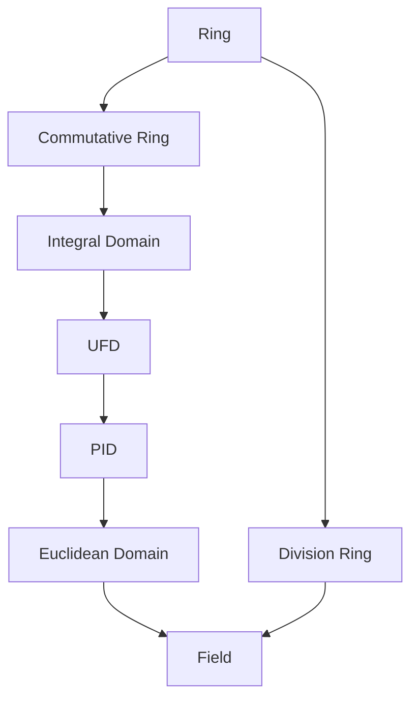

# Ring Theory

Ring theory studies algebraic structures with two operations: addition and multiplication. A ring generalizes the integers, capturing the essence of arithmetic operations.

## Core Concepts

### Foundations
- [[02 - Ring Theory/Concepts/Ring Definition|Ring Definition]]
- [[02 - Ring Theory/Concepts/Subrings|Subrings]]
- [[02 - Ring Theory/Concepts/Ring Homomorphisms|Ring Homomorphisms]]
- [[02 - Ring Theory/Concepts/Ideals|Ideals]]

### Structure Theory
- [[02 - Ring Theory/Concepts/Quotient Rings|Quotient Rings]]
- [[02 - Ring Theory/Concepts/Prime and Maximal Ideals|Prime and Maximal Ideals]]
- [[02 - Ring Theory/Concepts/Isomorphism Theorems for Rings|Isomorphism Theorems]]

### Special Rings
- [[02 - Ring Theory/Concepts/Integral Domains|Integral Domains]]
- [[02 - Ring Theory/Concepts/Principal Ideal Domains|Principal Ideal Domains (PIDs)]]
- [[02 - Ring Theory/Concepts/Unique Factorization Domains|Unique Factorization Domains (UFDs)]]
- [[02 - Ring Theory/Concepts/Euclidean Domains|Euclidean Domains]]
- [[02 - Ring Theory/Concepts/Polynomial Rings|Polynomial Rings]]

## Important Rings

| Ring | Notation | Properties |
|------|----------|------------|
| Integers | $\mathbb{Z}$ | Euclidean domain, PID, UFD |
| Polynomials over field | $F[x]$ | Euclidean domain, PID, UFD |
| Gaussian integers | $\mathbb{Z}[i]$ | Euclidean domain, PID, UFD |
| Integers mod $n$ | $\mathbb{Z}/n\mathbb{Z}$ | Field iff $n$ prime |
| Matrix ring | $M_n(R)$ | Non-commutative (if $n > 1$) |
| Quaternions | $\mathbb{H}$ | Division ring, non-commutative |

## Exercises by Difficulty

### Beginner
```dataview
TABLE status, source
FROM "02 - Ring Theory/Exercises"
WHERE difficulty = "beginner"
SORT file.name ASC
```

### Intermediate
```dataview
TABLE status, source
FROM "02 - Ring Theory/Exercises"
WHERE difficulty = "intermediate"
SORT file.name ASC
```

### Advanced
```dataview
TABLE status, source
FROM "02 - Ring Theory/Exercises"
WHERE difficulty = "advanced"
SORT file.name ASC
```

## Key Theorems

> [!abstract] First Isomorphism Theorem for Rings
> If $\phi: R \to S$ is a ring homomorphism, then $R/\ker(\phi) \cong \text{im}(\phi)$.

> [!abstract] Correspondence Theorem
> Ideals of $R/I$ correspond bijectively to ideals of $R$ containing $I$.

> [!abstract] Chinese Remainder Theorem
> If $I, J$ are coprime ideals (i.e., $I + J = R$), then:
> $$R/(I \cap J) \cong R/I \times R/J$$

## Ring Hierarchy



## Related Areas

- [[01 - Group Theory/Group Theory Hub|Group Theory]] - $(R, +)$ is an abelian group
- [[03 - Field Theory/Field Theory Hub|Field Theory]] - Fields are special rings
- [[04 - Module Theory/Module Theory Hub|Module Theory]] - Modules generalize vector spaces
