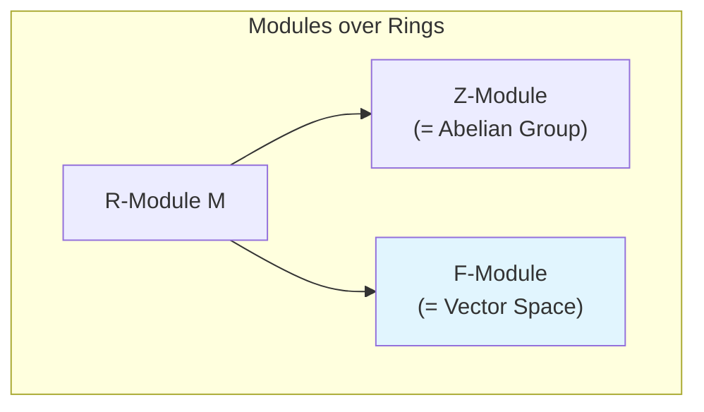

# Linear Algebra and Module Theory

This section covers linear algebra (vector spaces over fields) and its generalization to module theory (modules over rings). Vector spaces are the special case where the scalar ring is a field.

## Linear Algebra

### Foundations
- [[04 - Linear Algebra and Modules/Concepts/Vector Spaces|Vector Spaces]]
- [[04 - Linear Algebra and Modules/Concepts/Linear Transformations|Linear Transformations]]
- [[04 - Linear Algebra and Modules/Concepts/Subspaces|Subspaces]]
- [[04 - Linear Algebra and Modules/Concepts/Basis and Dimension|Basis and Dimension]]

### Core Topics
- [[04 - Linear Algebra and Modules/Concepts/Linear Independence|Linear Independence]]
- [[04 - Linear Algebra and Modules/Concepts/Eigenvalues and Eigenvectors|Eigenvalues and Eigenvectors]]
- [[04 - Linear Algebra and Modules/Concepts/Diagonalization|Diagonalization]]
- [[04 - Linear Algebra and Modules/Concepts/Inner Product Spaces|Inner Product Spaces]]

### Matrix Theory
- [[04 - Linear Algebra and Modules/Concepts/Matrix Representation|Matrix Representation]]
- [[04 - Linear Algebra and Modules/Concepts/Determinants|Determinants]]
- [[04 - Linear Algebra and Modules/Concepts/Rank and Nullity|Rank and Nullity]]

## Module Theory

### Foundations
- [[04 - Linear Algebra and Modules/Concepts/Module Definition|Module Definition]]
- [[04 - Linear Algebra and Modules/Concepts/Submodules|Submodules]]
- [[04 - Linear Algebra and Modules/Concepts/Module Homomorphisms|Module Homomorphisms]]
- [[04 - Linear Algebra and Modules/Concepts/Quotient Modules|Quotient Modules]]

### Structure Theory
- [[04 - Linear Algebra and Modules/Concepts/Free Modules|Free Modules]]
- [[04 - Linear Algebra and Modules/Concepts/Finitely Generated Modules|Finitely Generated Modules]]
- [[04 - Linear Algebra and Modules/Concepts/Torsion Modules|Torsion Modules]]
- [[04 - Linear Algebra and Modules/Concepts/Noetherian Modules|Noetherian Modules]]

### Constructions
- [[04 - Linear Algebra and Modules/Concepts/Direct Sum|Direct Sum]]
- [[04 - Linear Algebra and Modules/Concepts/Tensor Product|Tensor Product]]
- [[04 - Linear Algebra and Modules/Concepts/Exact Sequences|Exact Sequences]]
- [[04 - Linear Algebra and Modules/Concepts/Hom Functor|Hom Functor]]

## Relationship: Vector Spaces vs Modules



| Property | Vector Spaces (F-modules) | General Modules (R-modules) |
|----------|---------------------------|----------------------------|
| Scalars | Field F | Ring R |
| Basis existence | Always exists | Not always |
| Dimension | Well-defined | Rank (for free modules) |
| Direct complement | Always exists | Not always |
| Every subspace splits | Yes | No |

## Key Examples

| Module | Ring | Description |
|--------|------|-------------|
| $\mathbb{R}^n$ | $\mathbb{R}$ | Standard vector space |
| $\mathbb{C}$ over $\mathbb{R}$ | $\mathbb{R}$ | 2-dimensional vector space |
| Abelian group $G$ | $\mathbb{Z}$ | $\mathbb{Z}$-module |
| Ideal $I \subseteq R$ | Ring $R$ | $R$-submodule of $R$ |
| $R^n$ | Ring $R$ | Free module of rank $n$ |
| $K/F$ field extension | $F$ | Vector space of dimension $[K:F]$ |

## Exercises by Difficulty

### Beginner
```dataview
TABLE status, source
FROM "04 - Linear Algebra and Modules/Exercises"
WHERE difficulty = "beginner"
SORT file.name ASC
```

### Intermediate
```dataview
TABLE status, source
FROM "04 - Linear Algebra and Modules/Exercises"
WHERE difficulty = "intermediate"
SORT file.name ASC
```

### Advanced
```dataview
TABLE status, source
FROM "04 - Linear Algebra and Modules/Exercises"
WHERE difficulty = "advanced"
SORT file.name ASC
```

## Key Theorems

> [!abstract] Dimension Theorem (Rank-Nullity)
> For a linear transformation $T: V \to W$:
> $$\dim V = \dim(\ker T) + \dim(\text{im } T)$$

> [!abstract] Fundamental Theorem for Finitely Generated Modules over PID
> Let $R$ be a PID and $M$ a finitely generated $R$-module. Then:
> $$M \cong R^r \oplus R/(a_1) \oplus R/(a_2) \oplus \cdots \oplus R/(a_n)$$
> where $r \geq 0$ and $a_1 | a_2 | \cdots | a_n$ (invariant factors).

> [!abstract] Spectral Theorem
> A symmetric (or Hermitian) matrix is orthogonally (or unitarily) diagonalizable.

## Related Areas

- [[02 - Ring Theory/Ring Theory Hub|Ring Theory]] - Modules are over rings
- [[03 - Field Theory/Field Theory Hub|Field Theory]] - Field extensions as vector spaces
- [[06 - Representation Theory/Representation Theory Hub|Representation Theory]] - Group representations on vector spaces
- [[05 - Galois Theory/Galois Theory Hub|Galois Theory]] - Galois groups act on field extensions
