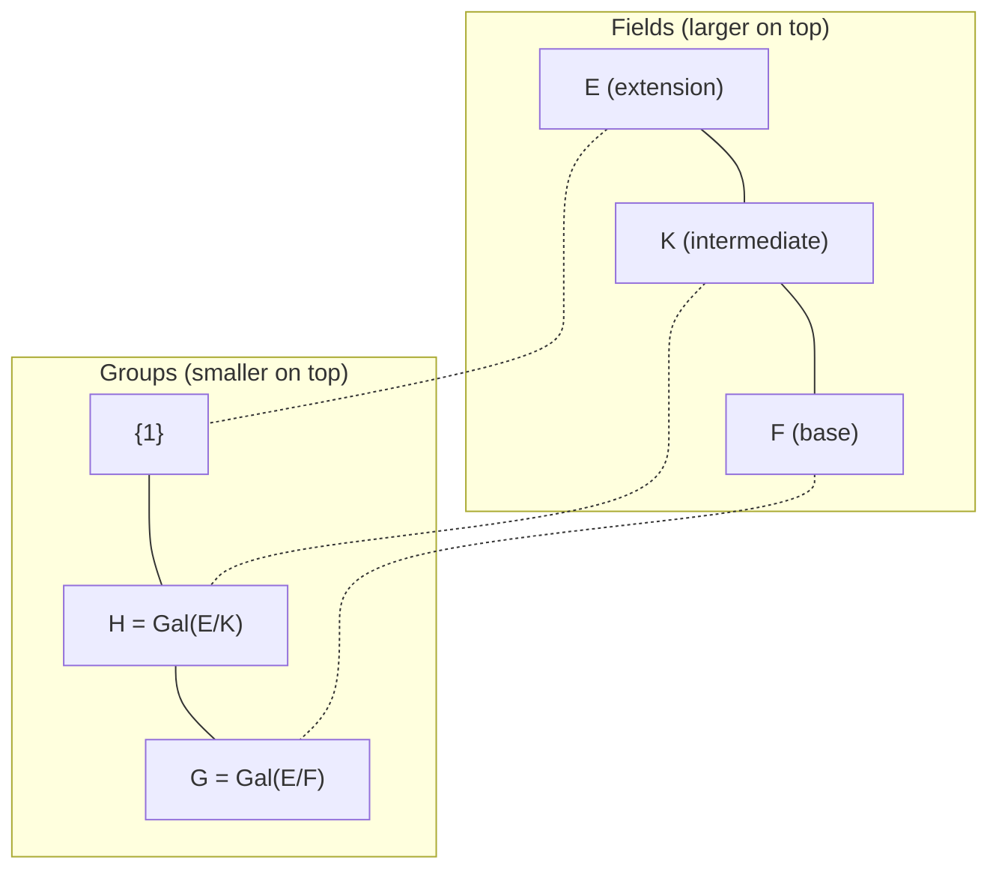

# Fundamental Theorem of Galois Theory

The Fundamental Theorem establishes a profound correspondence between the structure of a Galois extension and its Galois group.

## Statement

> [!abstract] Fundamental Theorem of Galois Theory
> Let $E/F$ be a finite Galois extension with Galois group $G = \text{Gal}(E/F)$. There is an inclusion-reversing bijection:
>
> $$\Phi: \{\text{intermediate fields } F \subseteq K \subseteq E\} \longleftrightarrow \{\text{subgroups } H \leq G\}$$
>
> given by:
> - $\Phi(K) = \text{Gal}(E/K)$ (field to subgroup)
> - $\Phi^{-1}(H) = E^H$ (subgroup to fixed field)

## Properties of the Correspondence

> [!info] Key Properties
> Under the Galois correspondence:
>
> 1. **Inclusion-reversing**: $K_1 \subseteq K_2 \iff \text{Gal}(E/K_1) \supseteq \text{Gal}(E/K_2)$
>
> 2. **Degree formula**:
>    - $[E:K] = |\text{Gal}(E/K)|$
>    - $[K:F] = [G : \text{Gal}(E/K)]$
>
> 3. **Normality criterion**: $K/F$ is normal $\iff$ $\text{Gal}(E/K) \trianglelefteq G$
>
> 4. **Quotient formula**: If $K/F$ is normal, then $\text{Gal}(K/F) \cong G/\text{Gal}(E/K)$

## Visualization

## Examples

> [!example] Example 1: $\mathbb{Q}(\sqrt{2}, \sqrt{3})/\mathbb{Q}$
> - $G = \text{Gal} \cong \mathbb{Z}/2\mathbb{Z} \times \mathbb{Z}/2\mathbb{Z}$ (Klein four-group)
> - Subgroups: $\{1\}, \langle\sigma\rangle, \langle\tau\rangle, \langle\sigma\tau\rangle, G$
> - Intermediate fields: $E, \mathbb{Q}(\sqrt{2}), \mathbb{Q}(\sqrt{3}), \mathbb{Q}(\sqrt{6}), \mathbb{Q}$

> [!example] Example 2: $\mathbb{Q}(\zeta_p)/\mathbb{Q}$ for prime $p$
> - $G \cong (\mathbb{Z}/p\mathbb{Z})^* \cong \mathbb{Z}/(p-1)\mathbb{Z}$ (cyclic)
> - Subgroups are cyclic, corresponding to intermediate cyclotomic fields

> [!example] Example 3: Splitting field of $x^3 - 2$
> - $G \cong S_3$
> - 6 subgroups correspond to 6 intermediate fields
> - $\mathbb{Q}(\sqrt[3]{2})$ corresponds to $\langle (123) \rangle \cong A_3$, which is normal
> - $\mathbb{Q}(\omega)$ corresponds to $\langle (12) \rangle$, which is not normal

## Applications

> [!tip] Using the Theorem
> 1. **Counting intermediate fields**: equals the number of subgroups of $G$
> 2. **Finding intermediate fields**: compute fixed fields of subgroups
> 3. **Determining normality**: check if corresponding subgroup is normal
> 4. **Computing Galois groups of intermediate extensions**: use quotient formula

## Proof Outline

> [!abstract] Key Steps
> 1. **Well-defined**: Show $\text{Gal}(E/K)$ is a subgroup and $E^H$ is an intermediate field
> 2. **$\Phi \circ \Phi^{-1} = id$**: Show $\text{Gal}(E/E^H) = H$ (uses Artin's theorem)
> 3. **$\Phi^{-1} \circ \Phi = id$**: Show $E^{\text{Gal}(E/K)} = K$ (uses $E/K$ is Galois)
> 4. **Normality**: Show $K/F$ normal $\iff$ $\text{Gal}(E/K)$ is closed under conjugation by $G$

## Related Concepts

- [[05 - Galois Theory/Concepts/Galois Group|Galois Group]]
- [[05 - Galois Theory/Concepts/Galois Extensions|Galois Extensions]]
- [[05 - Galois Theory/Concepts/Galois Correspondence|Galois Correspondence]]
- [[05 - Galois Theory/Concepts/Fixed Fields|Fixed Fields]]
