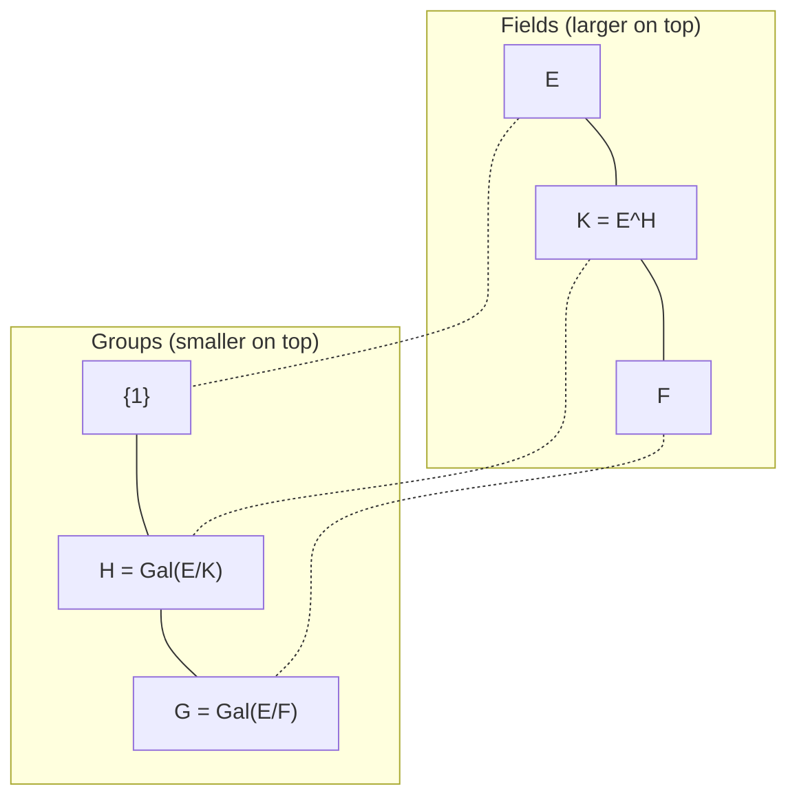

# Fundamental Theorem of Galois Theory

The **Galois correspondence** is the bijection asserted by the Fundamental Theorem of Galois Theory. They are therefore treated here as one concept: the theorem gives the precise statement and proof, while the phrase *Galois correspondence* emphasizes the resulting inclusion-reversing dictionary between fields and groups.

## Statement

> [!abstract] Fundamental Theorem of Galois Theory
> Let $E/F$ be a finite Galois extension, and let
>
> $$
> G=\operatorname{Gal}(E/F).
> $$
>
> There is an inclusion-reversing bijection between the intermediate fields $F\subseteq K\subseteq E$ and the subgroups $H\leq G$. Its two maps are
>
> $$
> K\longmapsto \operatorname{Gal}(E/K)
> $$
>
> and
>
> $$
> H\longmapsto E^H
> =\{x\in E:\sigma(x)=x\text{ for every }\sigma\in H\}.
> $$
>
> If $H=\operatorname{Gal}(E/K)$, then
>
> $$
> [E:K]=|H|,
> \qquad
> [K:F]=[G:H].
> $$
>
> Moreover, $K/F$ is Galois if and only if $H\trianglelefteq G$. In that case, restriction induces an isomorphism
>
> $$
> \operatorname{Gal}(K/F)\cong G/H.
> $$

The finiteness and Galois hypotheses on $E/F$ are essential here. Infinite Galois theory replaces arbitrary subgroups by closed subgroups for the Krull topology.

## Intuition

An intermediate field $K$ records which elements of $E$ are declared fixed. The subgroup $\operatorname{Gal}(E/K)$ records exactly which symmetries respect that declaration. A larger field contains more elements that must be fixed, so fewer automorphisms survive; this explains why the correspondence reverses inclusions.

## Lattice Structure

Let $K_i=E^{H_i}$ for $i=1,2$. The correspondence is an anti-isomorphism of lattices:

| Field operation | Corresponding group operation |
|---|---|
| $F$ | $G$ |
| $E$ | $\{1\}$ |
| $K_1\subseteq K_2$ | $H_1\supseteq H_2$ |
| $K_1\cap K_2$ | $\langle H_1,H_2\rangle$ |
| $K_1K_2$ | $H_1\cap H_2$ |

Here $K_1K_2$ is the compositum and $\langle H_1,H_2\rangle$ is the subgroup generated by $H_1$ and $H_2$.

## Proof

> [!success]- Proof of the finite correspondence
> We use the **Fixed Field Theorem**: if a finite group $H$ acts on a field $E$ by automorphisms, then
>
> $$
> [E:E^H]=|H|
> \quad\text{and}\quad
> \operatorname{Gal}(E/E^H)=H.
> $$
>
> The degree statement is Artin's Fixed Field Theorem 16.5.4; the equality of Galois groups is then established in Lemma 16.6.2(b).
>
> First let $H\leq G$. Every element of $H$ fixes $F$, so $F\subseteq E^H\subseteq E$. The Fixed Field Theorem gives
>
> $$
> \operatorname{Gal}(E/E^H)=H.
> $$
>
> Thus applying the field-to-subgroup map after the subgroup-to-field map returns $H$.
>
> Conversely, let $F\subseteq K\subseteq E$ and put $H=\operatorname{Gal}(E/K)$. Since $E/F$ is finite Galois, $E/K$ is also finite Galois. Hence
>
> $$
> |H|=[E:K].
> $$
>
> Every element of $K$ is fixed by $H$, so $K\subseteq E^H$. The Fixed Field Theorem gives
>
> $$
> [E:E^H]=|H|=[E:K].
> $$
>
> The inclusion and equality of degrees imply $K=E^H$. Therefore the two maps are inverse bijections.
>
> If $K_1\subseteq K_2$, every automorphism fixing $K_2$ fixes $K_1$, and consequently
>
> $$
> \operatorname{Gal}(E/K_2)\subseteq \operatorname{Gal}(E/K_1).
> $$
>
> This proves inclusion reversal. With $H=\operatorname{Gal}(E/K)$, the preceding argument and the tower law give
>
> $$
> [E:K]=|H|,
> \qquad
> [K:F]=\frac{[E:F]}{[E:K]}=\frac{|G|}{|H|}=[G:H].
> $$
>
> For the lattice operations, an automorphism fixes $K_1K_2$ exactly when it fixes both $K_1$ and $K_2$. Therefore
>
> $$
> \operatorname{Gal}(E/K_1K_2)=H_1\cap H_2.
> $$
>
> Also, the elements fixed by every element of $\langle H_1,H_2\rangle$ are precisely those fixed by both $H_1$ and $H_2$, so
>
> $$
> E^{\langle H_1,H_2\rangle}=K_1\cap K_2.
> $$
>
> Finally, for $\sigma\in G$ one has
>
> $$
> \sigma(E^H)=E^{\sigma H\sigma^{-1}}.
> $$
>
> Hence $H\trianglelefteq G$ if and only if every $\sigma\in G$ preserves $K=E^H$. By extension of embeddings and the fact that $E/F$ is normal, this is equivalent to $K/F$ being normal; separability is inherited from $E/F$, so it is equivalent to $K/F$ being Galois. When this holds, restriction defines a homomorphism
>
> $$
> \rho:G\longrightarrow\operatorname{Gal}(K/F),
> \qquad
> \rho(\sigma)=\sigma|_K,
> $$
>
> whose kernel is $H$. Its image has order
>
> $$
> [G:H]=[K:F]=|\operatorname{Gal}(K/F)|,
> $$
>
> so $\rho$ is surjective. The First Isomorphism Theorem now yields
>
> $$
> G/H\cong\operatorname{Gal}(K/F).
> $$

## Visualization


```mermaid
graph TB
    subgraph "Fields (larger on top)"
        E["E"]
        K["K = E^H"]
        F["F"]
    end

    subgraph "Groups (smaller on top)"
        I["{1}"]
        H["H = Gal(E/K)"]
        G["G = Gal(E/F)"]
    end

    E --- K --- F
    I --- H --- G
    E -..- I
    K -..- H
    F -..- G
```

## Examples

> [!example] Example 1: A biquadratic extension
> Let $E=\mathbb{Q}(\sqrt{2},\sqrt{3})$. Define $\sigma$ to change the sign of $\sqrt{2}$ and $\tau$ to change the sign of $\sqrt{3}$. Then
>
> $$
> G=\langle\sigma,\tau\rangle\cong C_2\times C_2.
> $$
>
> | Subgroup | Fixed field |
> |---|---|
> | $\{1\}$ | $\mathbb{Q}(\sqrt{2},\sqrt{3})$ |
> | $\langle\sigma\rangle$ | $\mathbb{Q}(\sqrt{3})$ |
> | $\langle\tau\rangle$ | $\mathbb{Q}(\sqrt{2})$ |
> | $\langle\sigma\tau\rangle$ | $\mathbb{Q}(\sqrt{6})$ |
> | $G$ | $\mathbb{Q}$ |
>
> Every subgroup of $G$ is normal, so every intermediate extension over $\mathbb{Q}$ is Galois.

> [!example] Example 2: The splitting field of $x^3-2$
> Let $E=\mathbb{Q}(\sqrt[3]{2},\omega)$, where $\omega$ is a primitive cube root of unity. Then $G\cong S_3$. The normal subgroup $A_3$ fixes the quadratic field $\mathbb{Q}(\omega)$, while the three nonnormal subgroups of order $2$ fix the three cubic fields generated by $\sqrt[3]{2}$, $\omega\sqrt[3]{2}$, and $\omega^2\sqrt[3]{2}$, respectively. Thus $\mathbb{Q}(\omega)/\mathbb{Q}$ is Galois, whereas none of those cubic extensions is Galois.

> [!example] Example 3: The eighth cyclotomic field
> For $E=\mathbb{Q}(\zeta_8)$,
>
> $$
> G\cong (\mathbb{Z}/8\mathbb{Z})^\times\cong C_2\times C_2.
> $$
>
> Its three subgroups of order $2$ correspond to the quadratic fields $\mathbb{Q}(i)$, $\mathbb{Q}(\sqrt{2})$, and $\mathbb{Q}(\sqrt{-2})$.

## Computing Fixed Fields

> [!tip] Practical method
> To determine $E^H$:
>
> 1. Find elements fixed by every $\sigma\in H$.
> 2. Use orbit sums such as $\sum_{\sigma\in H}\sigma(\alpha)$ to produce fixed elements.
> 3. Let $L$ be the field generated by the fixed elements found.
> 4. Verify $[E:L]=|H|$. Since $L\subseteq E^H$ and $[E:E^H]=|H|$, this degree check proves $L=E^H$.

## Applications

- Classify or count intermediate fields by classifying subgroups of $G$.
- Compute degrees of intermediate fields from subgroup orders and indices.
- Determine whether an intermediate extension is Galois by testing normality of its subgroup.
- Compute the Galois group of a normal intermediate extension as a quotient.
- Translate field intersections and composita into generated subgroups and subgroup intersections.

## Related Concepts

- [[05 - Galois Theory/Concepts/Fixed Fields|Fixed Fields]]
- [[05 - Galois Theory/Concepts/Galois Group|Galois Group]]
- [[05 - Galois Theory/Concepts/Galois Extensions|Galois Extensions]]
- [[05 - Galois Theory/Concepts/Normal Subgroups and Extensions|Normal Subgroups and Extensions]]
- [[05 - Galois Theory/Concepts/Composita and Restriction Maps|Composita and Restriction Maps]]
- [[01 - Group Theory/Concepts/Subgroups|Subgroups]]

## Exercises
```dataview
TABLE status,difficulty,source
FROM #exercise
WHERE contains(file.outlinks, this.file.link)
```

## Source and Proof Status

- **S1:** Michael Artin, *Algebra*, second edition.
- **Proved in the source:** Fixed Field Theorem 16.5.4, Main Theorem 16.7.1, its degree corollary, and the normal-subgroup criterion 16.7.5. [S1, Ch. 16, §§16.5–16.7, printed pp. 487–492, PDF pp. 499–504]
- **Independent derivation in this vault:** The proof above reorganizes those finite-case arguments into one self-contained narrative and derives the lattice formulas explicitly.
- **Imported source-level inputs:** existence of primitive elements for finite separable extensions, extension of field embeddings, and the First Isomorphism Theorem.
- **Boundary:** The note does not prove the infinite Galois correspondence, which requires the Krull topology and closed subgroups.
