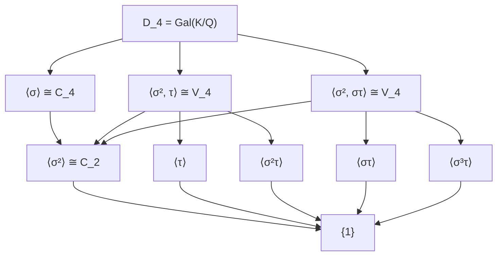

# Exercise Gal1: Galois Group of x^4 - 2

## Problem Statement

> [!question] Exercise
> Find the Galois group of $f(x) = x^4 - 2$ over $\mathbb{Q}$.

## Hints

> [!hint]- Hint 1
> The roots of $x^4 - 2$ are $\sqrt[4]{2}, i\sqrt[4]{2}, -\sqrt[4]{2}, -i\sqrt[4]{2}$.

> [!hint]- Hint 2
> The splitting field is $K = \mathbb{Q}(\sqrt[4]{2}, i)$.

> [!hint]- Hint 3
> Compute $[K:\mathbb{Q}]$ using the tower law.

## Solution

> [!success]- Solution
> ### Proof
> **Step 1: Find the splitting field.**
>
> The roots of $x^4 - 2$ are $\alpha, i\alpha, -\alpha, -i\alpha$ where $\alpha = \sqrt[4]{2}$.
>
> Splitting field: $K = \mathbb{Q}(\alpha, i)$
>
> **Step 2: Compute the degree.**
>
> $[\mathbb{Q}(\alpha):\mathbb{Q}] = 4$ (minimal polynomial $x^4 - 2$ is irreducible by Eisenstein)
>
> Is $i \in \mathbb{Q}(\alpha)$? No, because $\mathbb{Q}(\alpha) \subset \mathbb{R}$.
>
> $[\mathbb{Q}(\alpha, i):\mathbb{Q}(\alpha)] = 2$ (minimal polynomial $x^2 + 1$)
>
> By tower law: $[K:\mathbb{Q}] = 4 \cdot 2 = 8$
>
> **Step 3: Identify the Galois group.**
>
> $G = \text{Gal}(K/\mathbb{Q})$ has order 8.
>
> Define automorphisms by their action on generators $\alpha$ and $i$:
>
> - $\sigma$: $\alpha \mapsto i\alpha$, $i \mapsto i$ (order 4)
> - $\tau$: $\alpha \mapsto \alpha$, $i \mapsto -i$ (order 2)
>
> Relations:
> - $\sigma^4 = 1$, $\tau^2 = 1$
> - $\tau\sigma\tau = \sigma^{-1}$ (check: $\tau\sigma\tau(\alpha) = \tau\sigma(\alpha) = \tau(i\alpha) = -i\alpha = \sigma^{-1}(\alpha)$)
>
> This is the dihedral group: $G \cong D_4$
>
> **Step 4: Verify.**
>
> $D_4 = \langle \sigma, \tau : \sigma^4 = \tau^2 = 1, \tau\sigma\tau = \sigma^{-1} \rangle$
>
> Order $|D_4| = 8$ ✓
>
> Therefore $\text{Gal}(\mathbb{Q}(\sqrt[4]{2}, i)/\mathbb{Q}) \cong D_4$. $\square$

## Subgroup Lattice

## Related Concepts

- [[05 - Galois Theory/Concepts/Galois Group|Galois Group]]
- [[05 - Galois Theory/Concepts/Fundamental Theorem|Fundamental Theorem]]
- [[03 - Field Theory/Concepts/Splitting Fields|Splitting Fields]]
