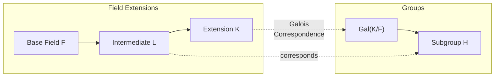

# Galois Theory

Galois theory establishes a profound connection between field extensions and group theory. It answers classical questions about solvability of polynomial equations by radicals.

## Core Concepts

### Foundations
- [[05 - Galois Theory/Concepts/Automorphisms|Field Automorphisms]]
- [[05 - Galois Theory/Concepts/Galois Group|Galois Group]]
- [[05 - Galois Theory/Concepts/Fixed Fields|Fixed Fields]]
- [[05 - Galois Theory/Concepts/Galois Extensions|Galois Extensions]]

### The Fundamental Theorem
- [[05 - Galois Theory/Concepts/Fundamental Theorem|Fundamental Theorem of Galois Theory]]
- [[05 - Galois Theory/Concepts/Galois Correspondence|Galois Correspondence]]
- [[05 - Galois Theory/Concepts/Normal Subgroups and Extensions|Normal Subgroups and Extensions]]

### Applications
- [[05 - Galois Theory/Concepts/Solvability by Radicals|Solvability by Radicals]]
- [[05 - Galois Theory/Concepts/Ruler and Compass|Ruler and Compass Constructions]]
- [[05 - Galois Theory/Concepts/Cyclotomic Extensions|Cyclotomic Extensions]]
- [[05 - Galois Theory/Concepts/Finite Fields Galois|Galois Theory of Finite Fields]]

## The Big Picture



## Exercises by Difficulty

### Beginner
```dataview
TABLE status, source
FROM "05 - Galois Theory/Exercises"
WHERE difficulty = "beginner"
SORT file.name ASC
```

### Intermediate
```dataview
TABLE status, source
FROM "05 - Galois Theory/Exercises"
WHERE difficulty = "intermediate"
SORT file.name ASC
```

### Advanced
```dataview
TABLE status, source
FROM "05 - Galois Theory/Exercises"
WHERE difficulty = "advanced"
SORT file.name ASC
```

## Key Theorems

> [!abstract] Fundamental Theorem of Galois Theory
> Let $K/F$ be a finite Galois extension with Galois group $G = \text{Gal}(K/F)$. There is a bijection:
> $$\{\text{intermediate fields } F \subseteq L \subseteq K\} \leftrightarrow \{\text{subgroups } H \leq G\}$$
> given by $L \mapsto \text{Gal}(K/L)$ and $H \mapsto K^H$ (fixed field).
>
> Moreover:
> - $[K:L] = |\text{Gal}(K/L)|$ and $[L:F] = [G : \text{Gal}(K/L)]$
> - $L/F$ is normal $\iff$ $\text{Gal}(K/L) \trianglelefteq G$
> - If $L/F$ is normal, then $\text{Gal}(L/F) \cong G/\text{Gal}(K/L)$

> [!abstract] Galois' Criterion for Solvability
> A polynomial $f(x) \in F[x]$ is solvable by radicals over $F$ if and only if its Galois group is solvable.

## Classical Applications

| Problem | Answer | Galois Group |
|---------|--------|--------------|
| Quadratic formula | Solvable | $S_2$ (solvable) |
| Cubic formula | Solvable | $S_3$ (solvable) |
| Quartic formula | Solvable | $S_4$ (solvable) |
| Quintic formula | **No general formula** | $S_5$ (not solvable) |
| Squaring the circle | Impossible | Transcendence of $\pi$ |
| Doubling the cube | Impossible | $[K:\mathbb{Q}] = 3 \neq 2^n$ |
| Trisecting angles | Generally impossible | Degree argument |

## Related Areas

- [[01 - Group Theory/Group Theory Hub|Group Theory]] - Galois groups
- [[03 - Field Theory/Field Theory Hub|Field Theory]] - Field extensions
- [[02 - Ring Theory/Ring Theory Hub|Ring Theory]] - Polynomial rings
