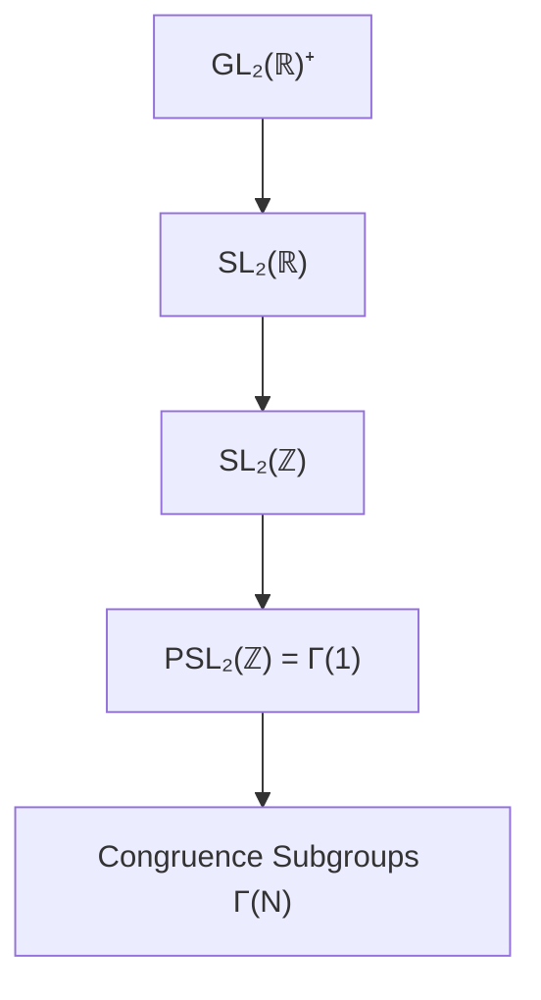

# Modular Group

## Definition

> [!info] Definition (Special Linear Group)
> The **special linear group** is:
> $$\text{SL}_2(\mathbb{Z}) = \left\{ \begin{pmatrix} a & b \\ c & d \end{pmatrix} : a, b, c, d \in \mathbb{Z}, \, ad - bc = 1 \right\}$$

> [!info] Definition (Modular Group)
> The **modular group** is the projective special linear group:
> $$\text{PSL}_2(\mathbb{Z}) = \text{SL}_2(\mathbb{Z}) / \{\pm I\}$$
> Often denoted $\Gamma(1)$ or simply $\Gamma$.

## Generators

> [!abstract] Theorem (Generators)
> $\text{SL}_2(\mathbb{Z})$ is generated by:
> $$S = \begin{pmatrix} 0 & -1 \\ 1 & 0 \end{pmatrix}, \quad T = \begin{pmatrix} 1 & 1 \\ 0 & 1 \end{pmatrix}$$
> with relations $S^2 = (ST)^3 = -I$ (in $\text{SL}_2(\mathbb{Z})$).

The generators act on the upper half-plane as:
- $S: \tau \mapsto -1/\tau$ (inversion)
- $T: \tau \mapsto \tau + 1$ (translation)

## Action on Upper Half-Plane

> [!info] Definition (Upper Half-Plane)
> $$\mathbb{H} = \{\tau \in \mathbb{C} : \text{Im}(\tau) > 0\}$$

> [!info] Definition (Möbius Transformation)
> For $\gamma = \begin{pmatrix} a & b \\ c & d \end{pmatrix} \in \text{SL}_2(\mathbb{Z})$, the action on $\mathbb{H}$ is:
> $$\gamma \cdot \tau = \frac{a\tau + b}{c\tau + d}$$

## Key Properties

1. The action is by holomorphic automorphisms of $\mathbb{H}$
2. $\text{Im}(\gamma \cdot \tau) = \frac{\text{Im}(\tau)}{|c\tau + d|^2}$
3. The stabilizer of $i$ in $\text{PSL}_2(\mathbb{Z})$ is $\langle S \rangle \cong \mathbb{Z}/2\mathbb{Z}$
4. The stabilizer of $\rho = e^{2\pi i/3}$ is $\langle ST \rangle \cong \mathbb{Z}/3\mathbb{Z}$

## Connection to Other Groups

## Examples

> [!example] Example 1: Powers of $T$
> $T^n = \begin{pmatrix} 1 & n \\ 0 & 1 \end{pmatrix}$ acts as $\tau \mapsto \tau + n$.

> [!example] Example 2: $S$ as inversion
> $S \cdot i = -1/i = i$, so $i$ is a fixed point.

> [!example] Example 3: Composition
> $ST = \begin{pmatrix} 0 & -1 \\ 1 & 1 \end{pmatrix}$ acts as $\tau \mapsto \frac{-1}{\tau + 1}$.

## Relation to Free Products

> [!abstract] Theorem
> $$\text{PSL}_2(\mathbb{Z}) \cong \mathbb{Z}/2\mathbb{Z} *_{\mathbb{Z}/1\mathbb{Z}} \mathbb{Z}/3\mathbb{Z}$$
> The modular group is the free product of cyclic groups amalgamated over the identity.

## Related Concepts

- [[07 - Modular Forms/Concepts/Fundamental Domain|Fundamental Domain]]
- [[07 - Modular Forms/Concepts/Congruence Subgroups|Congruence Subgroups]]
- [[07 - Modular Forms/Concepts/Modular Forms Definition|Modular Forms Definition]]
- [[01 - Group Theory/Concepts/Group Definition|Group Definition]]
- [[01 - Group Theory/Concepts/Group Actions|Group Actions]]
