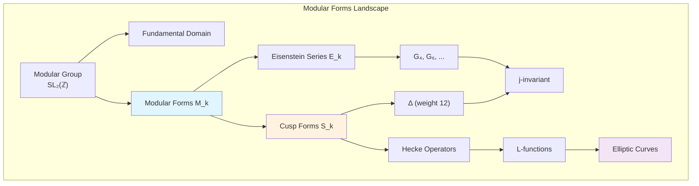

# Modular Forms

Modular forms are complex analytic functions on the upper half-plane that satisfy certain transformation properties under the action of the modular group. They are fundamental objects in number theory, connecting analysis, algebra, and arithmetic in profound ways.

## Foundations

### The Modular Group
- [[07 - Modular Forms/Concepts/Modular Group|Modular Group]] ($\text{SL}_2(\mathbb{Z})$ and $\text{PSL}_2(\mathbb{Z})$)
- [[07 - Modular Forms/Concepts/Fundamental Domain|Fundamental Domain]]
- [[07 - Modular Forms/Concepts/Congruence Subgroups|Congruence Subgroups]]

### Basic Definitions
- [[07 - Modular Forms/Concepts/Modular Forms Definition|Modular Forms Definition]]
- [[07 - Modular Forms/Concepts/Cusp Forms|Cusp Forms]]
- [[07 - Modular Forms/Concepts/Modular Functions|Modular Functions]]

## Classical Examples

- [[07 - Modular Forms/Concepts/Eisenstein Series|Eisenstein Series]]
- [[07 - Modular Forms/Concepts/Discriminant Function|Discriminant Function]] ($\Delta$)
- [[07 - Modular Forms/Concepts/j-Invariant|j-Invariant]]
- [[07 - Modular Forms/Concepts/Theta Functions|Theta Functions]]
- [[07 - Modular Forms/Concepts/Eta Function|Eta Function]] (Dedekind $\eta$)

## Structure and Operators

- [[07 - Modular Forms/Concepts/Hecke Operators|Hecke Operators]]
- [[07 - Modular Forms/Concepts/L-functions|L-functions]]
- [[07 - Modular Forms/Concepts/Riemann Zeta Function|Riemann Zeta Function]]
- [[07 - Modular Forms/Concepts/Petersson Inner Product|Petersson Inner Product]]

## Applications

- [[07 - Modular Forms/Concepts/Elliptic Curves and Modularity|Elliptic Curves and Modularity]]
- [[07 - Modular Forms/Concepts/Partition Function|Partition Function]]
- [[07 - Modular Forms/Concepts/Quadratic Forms|Quadratic Forms and Theta Series]]

## Key Relationships



## Dimension Formulas

| Weight $k$ | $\dim M_k(\text{SL}_2(\mathbb{Z}))$ | $\dim S_k(\text{SL}_2(\mathbb{Z}))$ |
|------------|-------------------------------------|-------------------------------------|
| 0 | 1 | 0 |
| 2 | 0 | 0 |
| 4 | 1 | 0 |
| 6 | 1 | 0 |
| 8 | 1 | 0 |
| 10 | 1 | 0 |
| 12 | 2 | 1 |
| $k \geq 4$ even | $\lfloor k/12 \rfloor + \epsilon$ | $\dim M_k - 1$ |

## Key Theorems

> [!abstract] Structure of $M_k$
> The graded ring of modular forms is:
> $$M_* = \bigoplus_{k \geq 0} M_k = \mathbb{C}[E_4, E_6]$$
> A polynomial algebra generated by Eisenstein series of weights 4 and 6.

> [!abstract] Modularity Theorem (Taniyama-Shimura-Weil)
> Every elliptic curve $E/\mathbb{Q}$ is modular: there exists a weight 2 newform $f$ such that $L(E, s) = L(f, s)$.

> [!abstract] Ramanujan Congruences
> For the partition function $p(n)$:
> - $p(5n + 4) \equiv 0 \pmod{5}$
> - $p(7n + 5) \equiv 0 \pmod{7}$
> - $p(11n + 6) \equiv 0 \pmod{11}$

## Exercises by Difficulty

### Beginner
```dataview
TABLE status, source
FROM "07 - Modular Forms/Exercises"
WHERE difficulty = "beginner"
SORT file.name ASC
```

### Intermediate
```dataview
TABLE status, source
FROM "07 - Modular Forms/Exercises"
WHERE difficulty = "intermediate"
SORT file.name ASC
```

### Advanced
```dataview
TABLE status, source
FROM "07 - Modular Forms/Exercises"
WHERE difficulty = "advanced"
SORT file.name ASC
```

## Connections to Other Topics

- [[01 - Group Theory/Group Theory Hub|Group Theory]] - The modular group $\text{SL}_2(\mathbb{Z})$
- [[03 - Field Theory/Field Theory Hub|Field Theory]] - Algebraic properties of modular forms
- [[05 - Galois Theory/Galois Theory Hub|Galois Theory]] - Galois representations attached to modular forms
- [[06 - Representation Theory/Representation Theory Hub|Representation Theory]] - Automorphic representations
- [[04 - Linear Algebra and Modules/Linear Algebra and Modules Hub|Linear Algebra]] - Spaces of modular forms as vector spaces

## References

- Serre, *A Course in Arithmetic* (Chapter VII)
- Diamond & Shurman, *A First Course in Modular Forms*
- Koblitz, *Introduction to Elliptic Curves and Modular Forms*
- Apostol, *Modular Functions and Dirichlet Series in Number Theory*
