# Arithmetic Geometry

Arithmetic Geometry lies at the intersection of algebraic geometry and number theory, studying geometric objects defined over arithmetically interesting fields (like $\mathbb{Q}$, number fields, finite fields, and $p$-adic fields). The central questions concern rational points, Diophantine equations, and the interplay between geometry and arithmetic.

## Algebraic Foundations

### Varieties and Schemes
- [[08 - Arithmetic Geometry/Concepts/Algebraic Varieties|Algebraic Varieties]]
- [[08 - Arithmetic Geometry/Concepts/Affine and Projective Varieties|Affine and Projective Varieties]]
- [[08 - Arithmetic Geometry/Concepts/Schemes|Schemes]]
- [[08 - Arithmetic Geometry/Concepts/Morphisms of Schemes|Morphisms of Schemes]]

### Arithmetic Foundations
- [[08 - Arithmetic Geometry/Concepts/p-adic Numbers|p-adic Numbers]]
- [[08 - Arithmetic Geometry/Concepts/Valuations and Places|Valuations and Places]]
- [[08 - Arithmetic Geometry/Concepts/Local Fields|Local Fields]]
- [[08 - Arithmetic Geometry/Concepts/Adeles and Ideles|Adeles and Ideles]]

## Core Arithmetic Geometry

### Rational Points
- [[08 - Arithmetic Geometry/Concepts/Rational Points|Rational Points]]
- [[08 - Arithmetic Geometry/Concepts/Heights|Heights]]
- [[08 - Arithmetic Geometry/Concepts/Reduction mod p|Reduction mod p]]
- [[08 - Arithmetic Geometry/Concepts/Local-Global Principles|Local-Global Principles]]

### Key Objects
- [[08 - Arithmetic Geometry/Concepts/Elliptic Curves Arithmetic|Elliptic Curves (Arithmetic)]]
- [[08 - Arithmetic Geometry/Concepts/Abelian Varieties|Abelian Varieties]]
- [[08 - Arithmetic Geometry/Concepts/Curves over Number Fields|Curves over Number Fields]]

## Advanced Topics

### Structure Theorems
- [[08 - Arithmetic Geometry/Concepts/Mordell-Weil Theorem|Mordell-Weil Theorem]]
- [[08 - Arithmetic Geometry/Concepts/Faltings Theorem|Faltings' Theorem]] (Mordell Conjecture)
- [[08 - Arithmetic Geometry/Concepts/Diophantine Equations|Diophantine Equations]]

### Cohomology and Representations
- [[08 - Arithmetic Geometry/Concepts/Etale Cohomology|Étale Cohomology]]
- [[08 - Arithmetic Geometry/Concepts/Galois Representations|Galois Representations]]
- [[08 - Arithmetic Geometry/Concepts/Zeta Functions of Varieties|Zeta Functions of Varieties]]

### Deep Structure
- [[08 - Arithmetic Geometry/Concepts/Motives|Motives]]
- [[08 - Arithmetic Geometry/Concepts/Periods|Periods]]

### Conjectures and Major Theorems
- [[08 - Arithmetic Geometry/Concepts/BSD Conjecture|Birch and Swinnerton-Dyer Conjecture]]
- [[08 - Arithmetic Geometry/Concepts/Gross-Zagier Kolyvagin|Gross-Zagier and Kolyvagin Theorem]]
- [[08 - Arithmetic Geometry/Concepts/Tate Conjecture|Tate Conjecture]]

### Langlands Program
- [[08 - Arithmetic Geometry/Concepts/Langlands Program|Langlands Program]]
- [[08 - Arithmetic Geometry/Concepts/Automorphic Representations|Automorphic Representations]]
- [[08 - Arithmetic Geometry/Concepts/Automorphic Forms|Automorphic Forms]]
- [[08 - Arithmetic Geometry/Concepts/Local Langlands Correspondence|Local Langlands Correspondence]]
- [[08 - Arithmetic Geometry/Concepts/L-Groups and Langlands Dual|L-Groups and Langlands Dual]]
- [[08 - Arithmetic Geometry/Concepts/Fundamental Lemma|Fundamental Lemma]]

### Classical Problems
- [[08 - Arithmetic Geometry/Concepts/Inverse Galois Problem|Inverse Galois Problem]]

## Central Themes

```mermaid
graph TB
    subgraph "Arithmetic Geometry Landscape"
        V["Varieties/Schemes<br>over ℚ, 𝔽ₚ, ℚₚ"]
        RP["Rational Points<br>X(K)"]
        H["Heights"]
        MW["Mordell-Weil<br>E(ℚ) f.g."]
        EC["Elliptic Curves"]
        AV["Abelian Varieties"]
        GR["Galois<br>Representations"]
        EC2["Étale<br>Cohomology"]
        ZF["Zeta Functions<br>L-functions"]
        BSD["BSD Conjecture"]
    end

    V --> RP
    V --> EC
    V --> AV
    EC --> MW
    EC --> GR
    AV --> MW
    RP --> H
    H --> MW
    EC --> ZF
    GR --> EC2
    ZF --> BSD
    MW --> BSD

    style RP fill:#e1f5fe
    style MW fill:#fff3e0
    style BSD fill:#f3e5f5
```



## Fundamental Questions

| Question | Object | Status |
|----------|--------|--------|
| When do rational points exist? | $X(\mathbb{Q}) \neq \emptyset$? | Open in general |
| Are rational points finite? | $\#X(\mathbb{Q}) < \infty$? | Faltings (genus $\geq 2$) |
| Structure of rational points? | $E(\mathbb{Q})$ | Mordell-Weil |
| How to find all rational points? | Algorithms | Active research |

## Key Theorems

> [!abstract] Mordell-Weil Theorem
> For an elliptic curve $E$ over a number field $K$:
> $$E(K) \cong \mathbb{Z}^r \oplus E(K)_{\text{tors}}$$
> where $r \geq 0$ is the **rank** and the torsion subgroup is finite.

> [!abstract] Faltings' Theorem (1983)
> A curve of genus $g \geq 2$ over a number field has only finitely many rational points.

> [!abstract] Hasse Principle
> A variety $X/\mathbb{Q}$ satisfies the **Hasse principle** if:
> $$X(\mathbb{Q}) \neq \emptyset \iff X(\mathbb{R}) \neq \emptyset \text{ and } X(\mathbb{Q}_p) \neq \emptyset \text{ for all } p$$

> [!abstract] Weil Conjectures (proved by Deligne)
> For a smooth projective variety $X$ over $\mathbb{F}_q$, the zeta function
> $$Z(X, t) = \exp\left(\sum_{n=1}^{\infty} \#X(\mathbb{F}_{q^n}) \frac{t^n}{n}\right)$$
> is rational, satisfies a functional equation, and its zeros have absolute value $q^{-i/2}$.

> [!abstract] Langlands Reciprocity (Vision)
> There should be a correspondence between $n$-dimensional Galois representations and automorphic representations of $\text{GL}_n$, matching L-functions.

> [!abstract] Local Langlands for GLₙ (Harris-Taylor, Henniart)
> There is a canonical bijection between irreducible smooth representations of $\text{GL}_n(F)$ over a local field and $n$-dimensional Weil-Deligne representations.

> [!abstract] Fundamental Lemma (Ngô, 2008)
> Orbital integrals on a reductive group match with stable orbital integrals on endoscopic groups, up to explicit transfer factors. Proved using geometry of the Hitchin fibration.

## Exercises by Difficulty

### Beginner
```dataview
TABLE status, source
FROM "08 - Arithmetic Geometry/Exercises"
WHERE difficulty = "beginner"
SORT file.name ASC
```

### Intermediate
```dataview
TABLE status, source
FROM "08 - Arithmetic Geometry/Exercises"
WHERE difficulty = "intermediate"
SORT file.name ASC
```

### Advanced
```dataview
TABLE status, source
FROM "08 - Arithmetic Geometry/Exercises"
WHERE difficulty = "advanced"
SORT file.name ASC
```

## Connections to Other Topics

- [[01 - Group Theory/Group Theory Hub|Group Theory]] - Group structure of $E(K)$, Galois groups
- [[03 - Field Theory/Field Theory Hub|Field Theory]] - Number fields, $p$-adic fields
- [[05 - Galois Theory/Galois Theory Hub|Galois Theory]] - Galois representations, absolute Galois group
- [[07 - Modular Forms/Modular Forms Hub|Modular Forms]] - Modularity theorem, L-functions
- [[02 - Ring Theory/Ring Theory Hub|Ring Theory]] - Rings of integers, Dedekind domains

## References

- Silverman, *The Arithmetic of Elliptic Curves*
- Hartshorne, *Algebraic Geometry*
- Serre, *A Course in Arithmetic* & *Local Fields*
- Cornell-Silverman-Stevens, *Modular Forms and Fermat's Last Theorem*
- Hindry-Silverman, *Diophantine Geometry*
- Milne, *Étale Cohomology*
