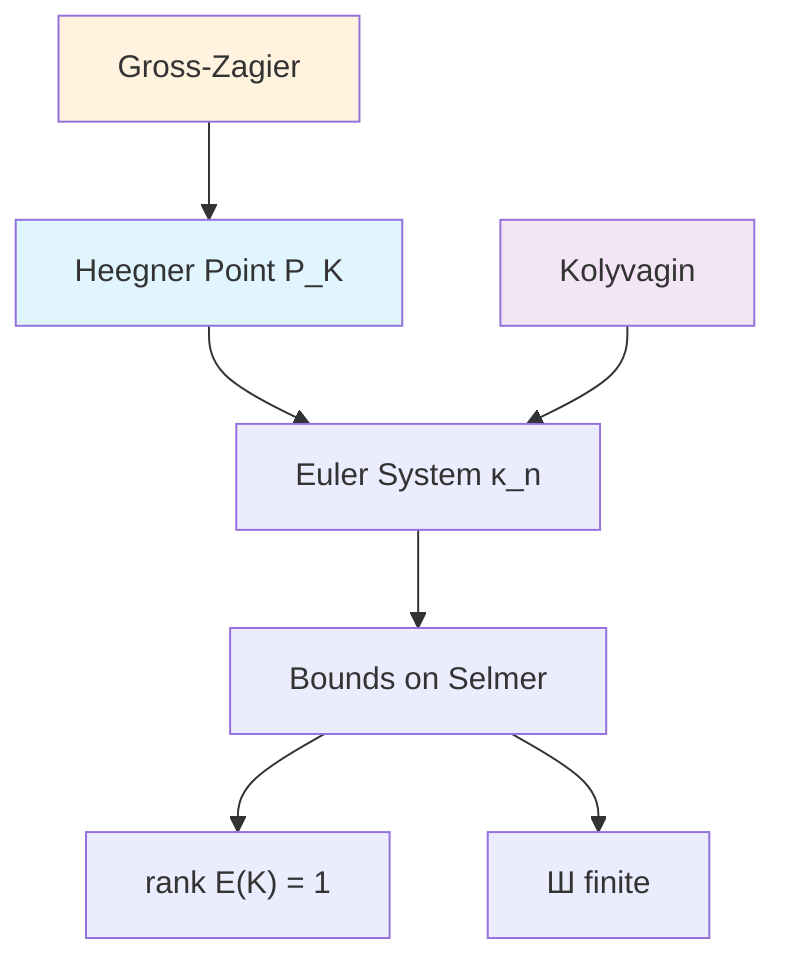

# Gross-Zagier and Kolyvagin Theorem

## Overview

The Gross-Zagier theorem and Kolyvagin's work together provide the strongest evidence for the Birch and Swinnerton-Dyer conjecture, proving it when the analytic rank is at most 1.

## The Gross-Zagier Theorem

> [!abstract] Theorem (Gross-Zagier, 1986)
> Let $E/\mathbb{Q}$ be an elliptic curve of conductor $N$, and let $K$ be an imaginary quadratic field satisfying the **Heegner hypothesis**: every prime $p | N$ splits in $K$.
>
> Let $P_K \in E(K)$ be a **Heegner point**. Then:
> $$L'(E/K, 1) = \frac{\Omega_E \cdot \hat{h}(P_K)}{u^2 \cdot \sqrt{|D_K|}} \cdot (\text{explicit constant})$$
>
> where:
> - $L'(E/K, 1)$ is the derivative of the L-function at $s = 1$
> - $\hat{h}(P_K)$ is the canonical (Néron-Tate) height of $P_K$
> - $D_K$ is the discriminant of $K$
> - $u = \#\mathcal{O}_K^\times / 2$

## Heegner Points

> [!info] Definition (Heegner Point)
> Let $K$ be an imaginary quadratic field and $\mathcal{O}$ an order in $K$. A **Heegner point** of conductor $c$ on $X_0(N)$ corresponds to a pair $(E, C)$ where:
> - $E$ is an elliptic curve with $\text{End}(E) \cong \mathcal{O}$
> - $C \subset E$ is a cyclic subgroup of order $N$
> - The pair has CM by $\mathcal{O}$

The modularity theorem gives a map $\phi: X_0(N) \to E$, and we define:
$$P_K = \phi(x_K) \in E(K)$$
where $x_K$ is a Heegner point on $X_0(N)$.

### Heegner Hypothesis

The Heegner hypothesis ensures that suitable Heegner points exist. It requires:
$$\left(\frac{D_K}{p}\right) = 1 \quad \text{for all primes } p | N$$

## Kolyvagin's Theorem

> [!abstract] Theorem (Kolyvagin, 1988-1990)
> Let $E/\mathbb{Q}$ be an elliptic curve and $K$ an imaginary quadratic field satisfying the Heegner hypothesis. If the Heegner point $P_K$ has infinite order, then:
>
> 1. $\text{rank}(E(K)) = 1$
> 2. $\text{Ш}(E/K)$ is finite

## Combined Result: BSD in Analytic Rank $\leq 1$

> [!abstract] Theorem (Gross-Zagier + Kolyvagin)
> Let $E/\mathbb{Q}$ be an elliptic curve.
>
> **Rank 0 case**: If $L(E, 1) \neq 0$, then:
> - $\text{rank}(E(\mathbb{Q})) = 0$
> - $\text{Ш}(E/\mathbb{Q})$ is finite
>
> **Rank 1 case**: If $L(E, 1) = 0$ and $L'(E, 1) \neq 0$, then:
> - $\text{rank}(E(\mathbb{Q})) = 1$
> - $\text{Ш}(E/\mathbb{Q})$ is finite

This proves **BSD rank conjecture** for analytic rank 0 and 1!

## The Argument

### Step 1: Gross-Zagier Formula

$$L'(E/K, 1) \neq 0 \iff \hat{h}(P_K) \neq 0 \iff P_K \text{ has infinite order}$$

### Step 2: Kolyvagin's Euler System

Kolyvagin constructs an **Euler system** of cohomology classes:
$$\kappa_n \in H^1(K, E[p^m])$$
indexed by squarefree products $n$ of "Kolyvagin primes."

These classes satisfy:
1. **Norm compatibility**: relates $\kappa_{n\ell}$ to $\kappa_n$
2. **Non-triviality**: derived from the Heegner point

### Step 3: Bounding Selmer Groups

The Euler system machinery bounds the Selmer group:
$$\text{Sel}_{p^\infty}(E/K) \text{ has } \mathbb{Z}_p\text{-corank } 1$$

This implies $\text{rank}(E(K)) = 1$ and finiteness of Ш.

## The Euler System Method

## Generalizations

### Higher Weight

> [!info] Gross-Zagier-Zhang
> Extends to modular forms of higher weight, relating central derivatives to heights of CM cycles on Shimura varieties.

### Totally Real Fields

> [!info] Yuan-Zhang-Zhang
> Generalizes to elliptic curves over totally real fields using Shimura curves.

### Higher Rank (Conjectural)

> [!warning] Open Problem
> For analytic rank $\geq 2$, we don't know how to prove BSD!
>
> The Heegner point $P_K$ is torsion when $\text{ord}_{s=1} L(E, s) \geq 2$.

## Computational Aspects

### Finding Heegner Points

Given $E/\mathbb{Q}$ with $L'(E, 1) \neq 0$:
1. Find suitable $K$ satisfying Heegner hypothesis
2. Compute the modular parametrization $\phi: X_0(N) \to E$
3. Find the CM point $x_K \in X_0(N)(H)$ where $H$ is the Hilbert class field
4. Compute $P_K = \text{Tr}_{H/K}(\phi(x_K))$

### Example Computation

> [!example] $E: y^2 = x^3 - x$, $K = \mathbb{Q}(\sqrt{-7})$
> - $N = 32$, and $(-7/2) = 1$ so Heegner hypothesis satisfied
> - Heegner point computation gives a point of infinite order
> - $L'(E/K, 1) \neq 0$ confirmed numerically

## What's NOT Known

| Analytic Rank | Algebraic Rank | BSD Status |
|---------------|----------------|------------|
| 0 | 0 | ✓ Proved |
| 1 | 1 | ✓ Proved |
| 2 | 2 | Open |
| $\geq 3$ | $\geq 3$ | Open |

For rank $\geq 2$:
- No known method to construct enough independent points
- Need "higher Heegner points" or new ideas

## Related Concepts

- [[08 - Arithmetic Geometry/Concepts/BSD Conjecture|BSD Conjecture]]
- [[08 - Arithmetic Geometry/Concepts/Elliptic Curves Arithmetic|Elliptic Curves Arithmetic]]
- [[08 - Arithmetic Geometry/Concepts/Heights|Heights]]
- [[08 - Arithmetic Geometry/Concepts/Mordell-Weil Theorem|Mordell-Weil Theorem]]
- [[07 - Modular Forms/Concepts/L-functions|L-functions]]
- [[08 - Arithmetic Geometry/Concepts/Galois Representations|Galois Representations]]

## Comment

1. **Benedict Hyman Gross** (born June 22, 1950, died December 19, 2025) was an American mathematician who was a professor at the [University of California, San Diego](https://en.wikipedia.org/wiki/University_of_California,_San_Diego "University of California, San Diego"),(https://en.wikipedia.org/wiki/Benedict_Gross#cite_note-1) the George Vasmer Leverett Professor of Mathematics Emeritus at [Harvard University](https://en.wikipedia.org/wiki/Harvard_University "Harvard University"), and former [Dean](https://en.wikipedia.org/wiki/Dean_\(education\) "Dean (education)") of Harvard College https://en.wikipedia.org/wiki/Benedict_Gross
2. Don Zagier：https://people.mpim-bonn.mpg.de/zagier/