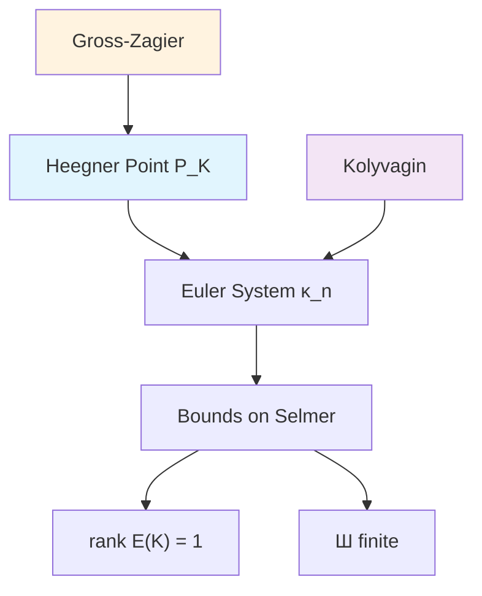

# Gross-Zagier and Kolyvagin Theorem

## Overview

The Gross–Zagier theorem and Kolyvagin's Euler-system work establish central rank-zero and rank-one cases of the Birch and Swinnerton-Dyer conjecture, subject to their precise modularity, Heegner, and local hypotheses.

## The Gross-Zagier Theorem

> [!warning] Schematic Gross–Zagier formula (not a citable theorem statement)
> Let $E/\mathbb{Q}$ be an elliptic curve of conductor $N$, and let $K$ be an imaginary quadratic field satisfying the **Heegner hypothesis**: every prime $p | N$ splits in $K$.
>
> Let $P_K \in E(K)$ be the trace to $K$ of the image of a suitable CM point under a modular parametrization. Then, after fixing all normalizations, a Gross–Zagier formula has the schematic form:
> $$
> L'(E/K,1)=C(E,K,\phi)\,\widehat h(P_K),
> $$
>
> where:
> - $L'(E/K, 1)$ is the derivative of the L-function at $s = 1$
> - $\hat{h}(P_K)$ is the canonical (Néron-Tate) height of $P_K$
> - $C(E,K,\phi)$ is an explicit nonzero factor depending on the modular parametrization, periods, discriminant, unit group, and local normalization conventions

## Heegner Points

> [!info] Definition (Heegner Point)
> Let $K$ be an imaginary quadratic field and $\mathcal{O}$ an order in $K$. A **Heegner point** of conductor $c$ on $X_0(N)$ corresponds to a pair $(E, C)$ where:
> - $E$ is an elliptic curve with $\text{End}(E) \cong \mathcal{O}$
> - $C \subset E$ is a cyclic subgroup of order $N$
> - The pair has CM by $\mathcal{O}$

The modularity theorem gives a map $\phi: X_0(N) \to E$. A CM point $x_K$ is generally defined over a Hilbert or ring class field $H$, not over $K$ itself; the $K$-rational Heegner point used in the rank argument is obtained, up to the chosen normalization, by
$$
P_K = \operatorname{Tr}_{H/K}\bigl(\phi(x_K)\bigr) \in E(K).
$$

### Heegner Hypothesis

The Heegner hypothesis ensures that suitable Heegner points exist. It requires:
$$
\left(\frac{D_K}{p}\right) = 1 \quad \text{for all primes } p | N
$$

## Kolyvagin's Theorem

> [!warning] Schematic Kolyvagin consequence
> Under the precise modularity, Heegner, residual-representation, and local hypotheses of the relevant theorem, if the Heegner point $P_K$ has infinite order, then:
>
> 1. $\text{rank}(E(K)) = 1$
> 2. $\text{Ш}(E/K)$ is finite

## Combined Result: BSD in Analytic Rank $\leq 1$

> [!abstract] Theorem (Gross-Zagier + Kolyvagin)
> Let $E/\mathbb{Q}$ be an elliptic curve.
>
> **Rank 0 case**: If $L(E, 1) \neq 0$, then:
> - $\text{rank}(E(\mathbb{Q})) = 0$
> - $\text{Ш}(E/\mathbb{Q})$ is finite
>
> **Rank 1 case**: If $L(E, 1) = 0$ and $L'(E, 1) \neq 0$, then:
> - $\text{rank}(E(\mathbb{Q})) = 1$
> - $\text{Ш}(E/\mathbb{Q})$ is finite

Together with the required auxiliary results and hypotheses, this proves the equality of analytic and algebraic ranks and finiteness of $\text{Ш}$ in analytic ranks $0$ and $1$; it does not by itself supply the full leading-term BSD formula.

## The Argument

### Step 1: Gross-Zagier Formula

$$
L'(E/K, 1) \neq 0 \iff \hat{h}(P_K) \neq 0 \iff P_K \text{ has infinite order}
$$

### Step 2: Kolyvagin's Euler System

Kolyvagin constructs an **Euler system** of cohomology classes:
$$
\kappa_n \in H^1(K, E[p^m])
$$
indexed by squarefree products $n$ of "Kolyvagin primes."

These classes satisfy:
1. **Norm compatibility**: relates $\kappa_{n\ell}$ to $\kappa_n$
2. **Non-triviality**: derived from the Heegner point

### Step 3: Bounding Selmer Groups

The Euler system machinery bounds the Selmer group:
$$
\text{Sel}_{p^\infty}(E/K) \text{ has } \mathbb{Z}_p\text{-corank } 1
$$

This implies $\text{rank}(E(K)) = 1$ and finiteness of Ш.

## The Euler System Method



```mermaid
graph TB
    HP["Heegner Point P_K"] --> ES["Euler System κ_n"]
    ES --> BD["Bounds on Selmer"]
    BD --> RK["rank E(K) = 1"]
    BD["Bounds on Selmer"] --> SHA["Ш finite"]

    GZ["Gross-Zagier"] --> HP
    KOL["Kolyvagin"] --> ES

    style HP fill:#e1f5fe
    style GZ fill:#fff3e0
    style KOL fill:#f3e5f5
```


## Generalizations

### Higher Weight

> [!info] Gross-Zagier-Zhang
> Extends to modular forms of higher weight, relating central derivatives to heights of CM cycles on Shimura varieties.

### Totally Real Fields

> [!info] Yuan-Zhang-Zhang
> Generalizes to elliptic curves over totally real fields using Shimura curves.

### Higher Rank (Conjectural)

> [!warning] Open Problem
> For analytic rank $\geq 2$, we don't know how to prove BSD!
>
> The behavior of a chosen Heegner point is governed by the relevant base-change derivative $L'(E/K,1)$ and cannot be inferred solely from the order of vanishing of $L(E,s)$.

## Computational Aspects

### Finding Heegner Points

Given $E/\mathbb{Q}$ with $L'(E, 1) \neq 0$:
1. Find suitable $K$ satisfying Heegner hypothesis
2. Compute the modular parametrization $\phi: X_0(N) \to E$
3. Find the CM point $x_K \in X_0(N)(H)$ where $H$ is the Hilbert class field
4. Compute $P_K = \text{Tr}_{H/K}(\phi(x_K))$

## What's NOT Known

| Analytic Rank | Rank equality and finiteness of $\Sha$ | Full leading-term BSD formula |
|---------------|------------------------------------------|-------------------------------|
| 0 | Known for elliptic curves over $\mathbb Q$ | Not asserted here |
| 1 | Known for elliptic curves over $\mathbb Q$ | Not asserted here |
| $\geq 2$ | Open in general | Open in general |

For rank $\geq 2$:
- No known method to construct enough independent points
- Need "higher Heegner points" or new ideas

## Related Concepts

- [[08 - Arithmetic Geometry/Concepts/BSD Conjecture|BSD Conjecture]]
- [[08 - Arithmetic Geometry/Concepts/Elliptic Curves Arithmetic|Elliptic Curves Arithmetic]]
- [[08 - Arithmetic Geometry/Concepts/Heights|Heights]]
- [[08 - Arithmetic Geometry/Concepts/Mordell-Weil Theorem|Mordell-Weil Theorem]]
- [[07 - Modular Forms/Concepts/L-functions|L-functions]]
- [[08 - Arithmetic Geometry/Concepts/Galois Representations|Galois Representations]]

## Exercises

```dataview
TABLE status,difficulty,source
FROM #exercise
WHERE contains(file.outlinks, this.file.link)
```


## Source and Proof Status

Eleven-source boundary audit: Diamond–Shurman says only that Gross and Zagier obtain points of infinite order when the conjectural rank is one [S7, §7.7, printed p. 298, PDF p. 311]; this is contextual and explicitly refers the reader elsewhere. Kac and Hall add no arithmetic input. Getz–Hahn [S11] discusses automorphic representations and trace formulae but does not state the normalized Gross–Zagier height formula or Kolyvagin's Euler-system theorem. The field of definition of the CM point has been corrected and the displayed results are explicitly schematic, with essential local factors and normalizations omitted; the note stays `unverified`.
