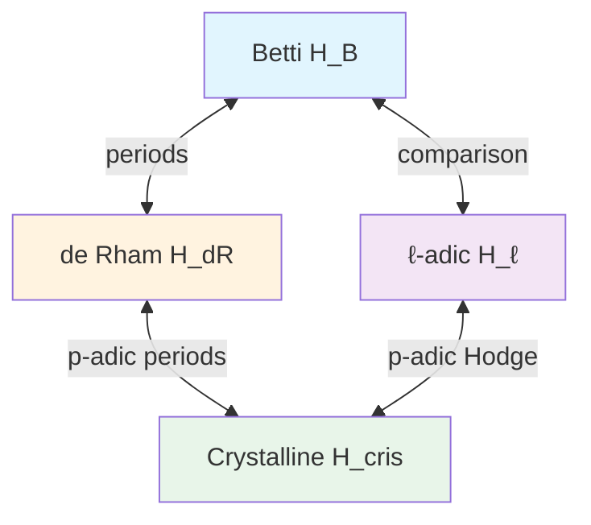

# Motives

## The Idea

> [!tip] Grothendieck's Vision
> Motives are the conjectural "universal cohomology theory" — a single object $h(X)$ from which all cohomology theories (Betti, de Rham, étale, crystalline) can be recovered.

A motive should capture the "arithmetic essence" of a variety, independent of any particular cohomology theory.

## Motivation: Why Motives?

### The Problem

For a smooth projective variety $X/\mathbb{Q}$, we have many cohomology theories:

| Theory | Coefficients | Captures |
|--------|--------------|----------|
| Betti $H^*_B$ | $\mathbb{Q}$ | Topology of $X(\mathbb{C})$ |
| de Rham $H^*_{\text{dR}}$ | $\mathbb{Q}$ | Algebraic differential forms |
| $\ell$-adic $H^*_{\text{ét}}$ | $\mathbb{Q}_\ell$ | Galois action |
| Crystalline $H^*_{\text{cris}}$ | $W(k)$ | $p$-adic structure |

These are **not the same**, but they're "the same size" (same Betti numbers) and related by comparison isomorphisms.

### The Solution

A motive $M$ should be a single object with:
- **Realizations**: $H_B(M)$, $H_{\text{dR}}(M)$, $H_\ell(M)$, etc.
- **Comparison isomorphisms** between realizations
- **Functoriality**: $M \mapsto H_*(M)$ is a functor for each theory

## Pure Motives

### Correspondences

> [!info] Definition (Correspondence)
> For smooth projective varieties $X, Y$, a **correspondence** of degree $r$ is:
> $$\text{Corr}^r(X, Y) = \text{CH}^{\dim X + r}(X \times Y) \otimes \mathbb{Q}$$
> where $\text{CH}^*$ is the Chow group.

Correspondences compose:
$$(\alpha \circ \beta) = (p_{13})_* (p_{12}^* \alpha \cdot p_{23}^* \beta)$$

### Category of Pure Motives

> [!info] Definition (Grothendieck's Pure Motives)
> The category $\mathcal{M}_{\text{rat}}(k)$ of **pure motives** over $k$ has:
> - **Objects**: Triples $(X, p, n)$ where $X$ is smooth projective, $p \in \text{Corr}^0(X, X)$ is an idempotent, $n \in \mathbb{Z}$
> - **Morphisms**: $\text{Hom}((X, p, m), (Y, q, n)) = q \circ \text{Corr}^{n-m}(X, Y) \circ p$

### The Tate Motive

> [!info] Definition
> The **Tate motive** $\mathbb{Q}(1)$ is the motive such that:
> - $H_B(\mathbb{Q}(1)) = 2\pi i \cdot \mathbb{Q}$
> - $H_{\text{dR}}(\mathbb{Q}(1)) = \mathbb{Q}$
> - $H_\ell(\mathbb{Q}(1)) = \mathbb{Q}_\ell(1)$ (cyclotomic character)

We write $\mathbb{Q}(n) = \mathbb{Q}(1)^{\otimes n}$ for **Tate twists**.

## Realizations

For a motive $M$:

| Realization | Description |
|-------------|-------------|
| $H_B(M)$ | $\mathbb{Q}$-vector space with Hodge structure |
| $H_{\text{dR}}(M)$ | $\mathbb{Q}$-vector space with filtration |
| $H_\ell(M)$ | $\mathbb{Q}_\ell$-vector space with $G_k$-action |
| $H_{\text{cris}}(M)$ | $p$-adic vector space with Frobenius |

### Comparison Isomorphisms

## Standard Conjectures

> [!abstract] Grothendieck's Standard Conjectures
> 1. **Lefschetz standard conjecture**: The Lefschetz operator $L^k: H^{n-k} \to H^{n+k}$ is induced by an algebraic cycle
> 2. **Hodge standard conjecture**: The Hodge $*$-operator is algebraic
> 3. **Künneth standard conjecture**: The Künneth components of the diagonal are algebraic

If true, these imply:
- The category of motives is **semisimple** (abelian, with every object a sum of simples)
- Weil cohomology theories factor through motives

## Mixed Motives

### Motivation

Pure motives only handle smooth projective varieties. For:
- Open varieties ($\mathbb{A}^n$, $\mathbb{G}_m$)
- Singular varieties
- Relative situations

we need **mixed motives**.

### Weight Filtration

> [!info] Definition
> A **mixed motive** $M$ has a **weight filtration**:
> $$0 = W_{-1} M \subset W_0 M \subset W_1 M \subset \cdots \subset M$$
> where $\text{gr}_n^W M = W_n M / W_{n-1} M$ is pure of weight $n$.

### Mixed Tate Motives

> [!info] Definition
> **Mixed Tate motives** $\mathcal{MT}(k)$ are mixed motives whose weight-graded pieces are sums of $\mathbb{Q}(n)$.

> [!abstract] Theorem (Deligne-Goncharov)
> The periods of mixed Tate motives over $\mathbb{Z}$ are $\mathbb{Q}$-linear combinations of **multiple zeta values**.

## The Motivic Galois Group

> [!info] Definition
> The **motivic Galois group** $\mathcal{G}_{\text{mot}}(k)$ is the Tannakian fundamental group of the category of motives.

For mixed Tate motives over $\mathbb{Q}$:
$$\mathcal{G}_{\text{MT}}(\mathbb{Q}) = \mathbb{G}_m \ltimes U$$
where $U$ is pro-unipotent, related to the Lie algebra of multiple zeta values.

## L-functions of Motives

> [!info] Definition
> For a motive $M$ over $\mathbb{Q}$, the **L-function** is:
> $$L(M, s) = \prod_p L_p(M, s)^{-1}$$
> where $L_p(M, s) = \det(1 - \text{Frob}_p \cdot p^{-s} | H_\ell(M)^{I_p})$.

### Conjectures

| Conjecture | Statement |
|------------|-----------|
| Meromorphic continuation | $L(M, s)$ extends to all $\mathbb{C}$ |
| Functional equation | $\Lambda(M, s) = \epsilon(M) \Lambda(M^\vee, 1-s)$ |
| Special values | Related to [[08 - Arithmetic Geometry/Concepts/Periods|periods]] and arithmetic invariants |

## Examples

> [!example] Example 1: $h(\text{pt}) = \mathbb{Q}(0)$
> The motive of a point. $L(\mathbb{Q}(0), s) = \zeta(s)$.

> [!example] Example 2: $h(\mathbb{P}^n) = \mathbb{Q}(0) \oplus \mathbb{Q}(-1) \oplus \cdots \oplus \mathbb{Q}(-n)$
> Projective space decomposes as Tate motives.

> [!example] Example 3: $h(E)$ for Elliptic Curve
> $$h(E) = \mathbb{Q}(0) \oplus h^1(E) \oplus \mathbb{Q}(-1)$$
> The "interesting part" $h^1(E)$ is 2-dimensional, weight 1.
> $L(h^1(E), s) = L(E, s)$.

> [!example] Example 4: $h(X)$ for Abelian Variety
> $$h(A) = \bigoplus_{i=0}^{2g} h^i(A), \quad h^i(A) = \bigwedge^i h^1(A)$$

## Voevodsky's Motives

> [!info] Triangulated Category
> Voevodsky constructed $\mathbf{DM}(k)$, a triangulated category of motives over $k$.
>
> - Contains all varieties (not just smooth projective)
> - Has the "correct" properties for a derived category
> - Connects to motivic cohomology and K-theory

## Motivic Cohomology

> [!info] Definition
> **Motivic cohomology** $H^{p,q}_{\text{mot}}(X, \mathbb{Z})$ is a bigraded theory satisfying:
> $$H^{p,p}_{\text{mot}}(X, \mathbb{Z}) = \text{CH}^p(X)$$
> and related to algebraic K-theory via the motivic spectral sequence.

## Related Concepts

- [[08 - Arithmetic Geometry/Concepts/Periods|Periods]]
- [[08 - Arithmetic Geometry/Concepts/Etale Cohomology|Étale Cohomology]]
- [[08 - Arithmetic Geometry/Concepts/Galois Representations|Galois Representations]]
- [[08 - Arithmetic Geometry/Concepts/Zeta Functions of Varieties|Zeta Functions]]
- [[08 - Arithmetic Geometry/Concepts/Tate Conjecture|Tate Conjecture]]
- [[08 - Arithmetic Geometry/Concepts/BSD Conjecture|BSD Conjecture]]
