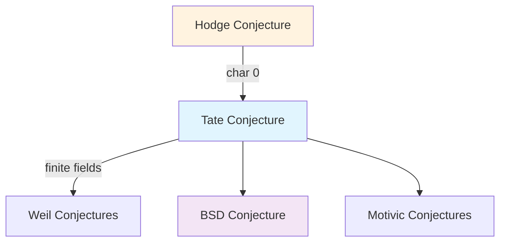

# Tate Conjecture

## Statement

> [!abstract] Tate Conjecture
> Let $X$ be a smooth projective variety over a finitely generated field $k$. Let $\ell$ be a prime different from $\text{char}(k)$. Then:
>
> **1. Tate Conjecture (Algebraic Cycles)**:
> The cycle class map
> $$\text{CH}^i(X) \otimes \mathbb{Q}_\ell \to H^{2i}_{\text{ét}}(X_{\bar{k}}, \mathbb{Q}_\ell(i))^{G_k}$$
> is surjective.
>
> **2. Semisimplicity Conjecture**:
> The Galois representation $H^i_{\text{ét}}(X_{\bar{k}}, \mathbb{Q}_\ell)$ is semisimple.

## Interpretation

The Tate conjecture predicts that **algebraic cycles** account for all Galois-invariant classes in étale cohomology.

| Object | Meaning |
|--------|---------|
| $\text{CH}^i(X)$ | Chow group of codimension $i$ cycles modulo rational equivalence |
| $H^{2i}_{\text{ét}}(X_{\bar{k}}, \mathbb{Q}_\ell(i))$ | Étale cohomology with Tate twist |
| $(-)^{G_k}$ | Galois invariants |

## Special Cases

### Divisors ($i = 1$)

> [!abstract] Tate Conjecture for Divisors
> $$\text{NS}(X) \otimes \mathbb{Q}_\ell \xrightarrow{\sim} H^2_{\text{ét}}(X_{\bar{k}}, \mathbb{Q}_\ell(1))^{G_k}$$
> where $\text{NS}(X)$ is the Néron-Severi group.

This is known for:
- Abelian varieties over finite fields (Tate)
- K3 surfaces over finite fields (recent work)
- Many other special cases

### For Abelian Varieties

> [!abstract] Theorem (Tate, Faltings)
> The Tate conjecture holds for abelian varieties over:
> - Finite fields (Tate, 1966)
> - Number fields (Faltings, 1983)

**Consequence**: Abelian varieties $A, B$ over a number field $K$ satisfy:
$$\text{Hom}_K(A, B) \otimes \mathbb{Z}_\ell \xrightarrow{\sim} \text{Hom}_{G_K}(T_\ell(A), T_\ell(B))$$

## Relation to Other Conjectures

### Hodge vs Tate

| Setting | Conjecture | Invariants |
|---------|------------|------------|
| $\mathbb{C}$ | Hodge | $(p,p)$-classes in $H^{2p}(X, \mathbb{Q})$ |
| Finite/Number fields | Tate | Galois-invariant classes in $H^{2p}_{\text{ét}}$ |

## What's Known

### Positive Results

| Variety | Field | Status |
|---------|-------|--------|
| Abelian varieties | Finite fields | ✓ Tate |
| Abelian varieties | Number fields | ✓ Faltings |
| K3 surfaces | Finite fields | ✓ (various authors) |
| Products of curves | Number fields | ✓ |
| Fermat hypersurfaces | Finite fields | Partial |

### Open Cases

- General varieties over number fields
- Higher codimension cycles ($i > 1$) in most cases
- Varieties over function fields (some cases)

## Implications

### For Endomorphisms

If Tate holds for $A \times A$ where $A$ is an abelian variety:
$$\text{End}(A) \otimes \mathbb{Q}_\ell \cong \text{End}_{G_k}(V_\ell(A))$$

This determines $\text{End}(A)$ from Galois representations!

### For Motives

The Tate conjecture is part of the **standard conjectures** for algebraic cycles, which would imply:
- Existence of a good category of motives
- Rationality and functional equation of zeta functions

## The Tate-Shafarevich Perspective

> [!info] Connection to Sha
> For an abelian variety $A/K$:
> $$\text{Ш}(A/K)[\ell^\infty] \hookrightarrow H^1(K, T_\ell(A)) / \text{(image of Selmer)}$$
>
> The Tate conjecture relates to finiteness of Sha.

## Examples

> [!example] Example 1: Elliptic Curve over $\mathbb{F}_p$
> $E/\mathbb{F}_p$: Tate's theorem says
> $$\text{End}(E) \otimes \mathbb{Z}_\ell \cong \text{End}_{G_{\mathbb{F}_p}}(T_\ell(E))$$
>
> For ordinary $E$: $\text{End}(E) = \mathbb{Z}$ or an order in a quadratic field.
> For supersingular $E$: $\text{End}(E)$ is a maximal order in a quaternion algebra.

> [!example] Example 2: Product $E \times E'$
> For distinct elliptic curves, Tate implies:
> $$\text{Hom}(E, E') \otimes \mathbb{Z}_\ell \cong \text{Hom}_{G_K}(T_\ell(E), T_\ell(E'))$$
>
> If $E, E'$ are non-isogenous, both sides are 0.

## Related Concepts

- [[08 - Arithmetic Geometry/Concepts/Etale Cohomology|Étale Cohomology]]
- [[08 - Arithmetic Geometry/Concepts/Galois Representations|Galois Representations]]
- [[08 - Arithmetic Geometry/Concepts/Abelian Varieties|Abelian Varieties]]
- [[08 - Arithmetic Geometry/Concepts/Zeta Functions of Varieties|Zeta Functions]]
- [[08 - Arithmetic Geometry/Concepts/BSD Conjecture|BSD Conjecture]]
