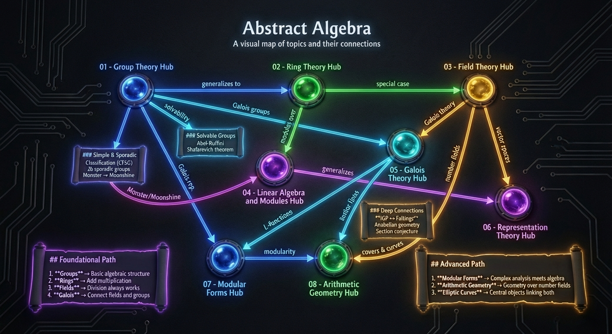

# Abstract Algebra Exercises

An Obsidian vault for studying abstract algebra, featuring exercises, concepts, and visual maps covering the major topics.



## Topics Covered

- **Group Theory** - Groups, subgroups, homomorphisms, quotient groups, Sylow theorems
- **Ring Theory** - Rings, ideals, quotient rings, PIDs, UFDs
- **Field Theory** - Field extensions, algebraic elements, splitting fields
- **Linear Algebra & Modules** - Vector spaces, linear transformations, modules over rings
- **Galois Theory** - Galois groups, fundamental theorem, solvability by radicals
- **Representation Theory** - Group representations, characters, Maschke's theorem, Lie groups, Lie algebras
- **Modular Forms** - Modular group, cusp forms, Hecke operators, L-functions, modularity theorem
- **Arithmetic Geometry** - Elliptic curves, rational points, schemes, BSD conjecture, Galois representations

## Structure

```
exercise_abstract/
├── 00 - Home/           # Index, trackers, and base files
├── 01 - Group Theory/   # Concepts and exercises
├── 02 - Ring Theory/    # Concepts and exercises
├── 03 - Field Theory/   # Concepts and exercises
├── 04 - Linear Algebra and Modules/  # Concepts and exercises
├── 05 - Galois Theory/  # Concepts and exercises
├── 06 - Representation Theory/  # Concepts and exercises
├── 07 - Modular Forms/  # Concepts and exercises
├── 08 - Arithmetic Geometry/  # Concepts and exercises
├── Canvas/              # Visual topic maps
├── Templates/           # Exercise and concept templates
└── Attachments/         # Images and files
```

## Features

### Obsidian Bases
- **Exercise Tracker** - Track progress across all exercises
- **Concept Index** - Browse and search concepts
- **Study Progress** - Filter by difficulty and topic

### JSON Canvas
- **Abstract Algebra Overview** - High-level topic connections
- **Topic Relationships** - Detailed concept hierarchy
- **Study Roadmap** - Suggested learning path

### Templates
- **Exercise Template** - Structured format with hints and solutions
- **Concept Template** - Definitions, examples, and related concepts

## Plugins Used

- **Dataview** - Dynamic queries and progress tracking
- **Templater** - Template insertion
- **LaTeX Suite** - Math typing shortcuts
- **TikZJax** - Commutative diagrams
- **Excalidraw** - Freeform diagrams

## Getting Started

1. Open the vault in Obsidian
2. Start at `00 - Home/Index.md`
3. Follow the study roadmap or explore by topic
4. Use the Exercise Tracker to monitor progress

## Exercise Format

Each exercise includes:
- Problem statement in callout format
- Progressive hints (collapsed by default)
- Full solution (collapsed by default)
- Related concepts and notes
- YAML frontmatter for tracking (status, difficulty, topic, source)

---

## Changelog

### 2026-08-12 (Exercise Gal7 Compositum Rewrite)
- Rewritten: Replaced the incomplete Pell-unit and prime-ideal arguments in Exercise Gal7 with source-level compositum proofs: a disjoint $C_3$-extension and $S_3$-extension over $F$ in part (a), and an $S_4$ quartic splitting field composed with $\mathbb Q(\sqrt{10})$ in part (b).
- Refined: Recast part (a) using the product and quotient resolvents $c=uv$ and $q=u/v$, eliminating the detour through two absolute $S_3$ fields and the Fourier inversion argument.
- Clarified: Simplified the field map in part (b) to the essential tower $\mathbb Q\subset F\subset H\subset K$, where $H$ is the $S_4$ splitting field generated by pairwise products and $K=H(\sqrt{10})$.
- Verified: Retained both the resolvent-cubic proof and the direct degree-$6$-subfield proof of the $S_4$ result; also checked the Eisenstein arguments, discriminants, field intersections, reverse generator recovery, and Obsidian-native formula delimiters.

### 2026-08-12 (Composita, Square Classes, and Quaternion Extensions)
- Added: Five Galois Theory exercises, **Gal72–Gal76**, on composita and restriction maps, an $S_3\times C_2$ intermediate-field classification, a compositum of two $S_3$ splitting fields, square-class criteria for biquadratic extensions, and Milne's quaternion Galois extension.
- Added: Concept notes on composita and restriction maps, square classes and multiquadratic extensions, and the quaternion group, with reciprocal exercise links and hub integration.
- Corrected: Repaired the supplied minimal-polynomial typo, distinguished internal semidirect products from direct products, and replaced an erroneous commuting relation in the $Q_8$ construction by the correct anticommutation relation.
- Documented: Marked inaccessible web-linked problem statements as user-supplied and independently derived, while verifying Milne Exercise 3-3 against the official v5.10 PDF.

### 2026-08-12 (Artin Chapter 16 Exercise Archive)
- Added: Archived 81 previously missing exercises from Michael Artin's *Algebra*, Chapter 16, with exact source-section and printed/PDF page provenance, progressive hints, and independently derived solutions.
- Routed: Classified the exercises by their primary toolkit into Ring Theory (R7–R18), Field Theory (F24–F27), Group Theory (G26–G27), Linear Algebra (LA9), Galois Theory (Gal11–Gal71), and Representation Theory (Rep11).
- Deduplicated: Reused the nine existing Chapter 16 exercises 9.10–9.18 instead of creating duplicate notes.
- Added: Created concept notes for symmetric polynomials and Newton identities, polynomial discriminants, and Kummer extensions; updated the Ring Theory and Galois Theory hubs and reciprocal concept links.
- Fixed: Converted every formula in the new Chapter 16 notes from LaTeX document delimiters to Obsidian-native `$...$` and `$$...$$` syntax, and added an enforceable formula-syntax rule to `AGENTS.md`.
- Improved: Rewrote Exercise Gal14 with a complete algebraic-closure proof and a second base-field-independent rational-function proof, explicitly closing the omitted nonzero-polynomial step.
- Verified: Recorded characteristic restrictions, source ambiguities, external proof inputs, and computational-verification boundaries; corrected the reducible cubic in Exercise 8.2(b) and preserved the shifted denominator in M.8.

### 2026-08-11 (Exercise R6: Cauchy Sequence Ideal)
- Added: A complete Ring Theory exercise proving that the rational Cauchy sequences converging to zero form a maximal ideal in the ring of rational Cauchy sequences.
- Derived: Supplied an independent proof using boundedness, a finite-term modification, a uniform lower bound away from zero, and the Cauchy estimate for the reciprocal sequence.
- Documented: Recorded Zou Ying's *Mathematical Analysis, Vol. I*, Chapter 2, Exercise 6 as the direct source, while labeling the Ramis–Deschamps–Odoux connection as a likely French-textbook influence rather than a verified literal translation.
- Linked: Added reciprocal exercise links from the Ideals, Prime and Maximal Ideals, and Quotient Rings concept notes.

### 2026-08-11 (Exercise LA8 Inductive Proof)
- Expanded: Added a complete algebraic induction proof that every real symplectic matrix has determinant $1$, using a complex invariant plane and separate nondegenerate and isotropic cases.
- Archived: Added three photographs from the user-supplied WeChat source, which presents them as a student-era assignment by 2026 Fields Medalist Hong Wang; the note links the direct image source, verifies her award through the official IMU announcement, and records the absence of an institutional archival check.
- Clarified: Corrected the second manuscript branch to $\omega(y_1,y_2)=0$, supplied the omitted invariant-complement and block-matrix arguments, and distinguished Artin's exercise statement from the external manuscript and the independent rewrite.

### 2026-08-11 (Artin Chapter 16 Quartic Equations)
- Added: Seven new Galois Theory exercise notes, **Gal4–Gal10**, for Artin Exercises 9.10 and 9.12–9.17, and expanded the existing **Gal1** and **Gal2** notes to archive Exercises 9.11 and 9.18 without renumbering them.
- Added: Complete quartic Galois-group classifications, two full $D_4$ subgroup–fixed-field correspondences, Kummer calculations for nested radicals over $\mathbb Q(\omega)$, an explicit nested-square-root recovery formula, the general resolvent cubic, and the constructibility criterion for real quartics.
- Added: A source-grounded Quartic Resolvents and Galois Groups concept note, linked from the Galois Theory Hub and reciprocally connected to the prerequisite concepts and exercises.
- Verified: The exercise statements on Artin printed p. 509 (PDF p. 521) and the quartic/resolvent conventions on printed pp. 493–496 (PDF pp. 505–508); exact SageMath checks independently confirmed the finite polynomial and nested-radical group computations.
- Documented: The missing characteristic restrictions in Exercises 9.15 and 9.18, the external Pell-unit input in Exercise 9.14, and the boundary between Artin's proofs, independent derivations, and computational verification.

### 2026-08-10 (Exercise AG12 Revision)
- Revised: Reorganized Exercise AG12 as the source's progressive chain: part (a) classifies the seven isomorphism classes, part (b) assigns gluing data to those classes, and part (c) realizes the same labeled classes by explicit polynomials.
- Clarified: Fixed the permutation ordering, the affine-plane role of monodromy at infinity, and the distinction between “ramified only at” and requiring both displayed points to be true branch points.
- Corrected: Confirmed that the printed $F[t]/(f)$ in Exercise 9.3(c) should be $F[x]/(f)$, while preserving the source wording and recording the correction visibly in AG12.

### 2026-08-10 (Artin Chapter 15 Fields)
- Added: Twenty-nine source-verified exercise notes covering Artin Chapter 15 Exercises 6.3, 7.1–7.14, 8.1–8.2, 9.1–9.5, 10.1–10.4, and M.1–M.3, routed to Galois Theory, Ring Theory, Field Theory, and Arithmetic Geometry by their primary proof toolkit.
- Added: Complete finite-field computations, primitive-element classifications, quadratic and rational-function arguments, function-field monodromy data, the quadratic Riemann Existence proof, and program listings for monodromy continuation and polynomial-circle visualization.
- Generated: A reproducible six-panel SageMath visualization for Exercise F20, archived as a PNG and embedded in the note together with its WSL-compatible Sage Python generator.
- Expanded: The Algebraic Closure concept note with Artin's circle-image proof outline of the Fundamental Theorem of Algebra, an explicit winding-number proof boundary, and an explanation of what the F20 Sage visualization represents.
- Added: A Branch Points and Monodromy concept note with source-status boundaries, true-versus-false branch-point distinctions, and links to Exercises AG11–AG14.
- Documented: The literal $n=1,2$ ambiguity in Exercise 6.3, the printed $F[t]/(f)$ notation issue and the alternative “at most” versus “exactly” interpretation in Exercise 9.3, and every external theorem or computational-verification boundary used by the solutions.
- Updated: Arithmetic Geometry Hub and the Finite Fields, Algebraic Closure, Cyclotomic Extensions, Polynomial Rings, and Separable Extensions concept notes with the new bidirectional links.

### 2026-08-10 (Codex Workflow and Artin Chapter 9)
- Added: A project-level `AGENTS.md` defining Codex rules for tool-based topic routing, one-exercise-per-note archival, source verification, figure handling, concept linking, Study Progress metadata, and validation.
- Updated: Translated the project-level Codex working rules in `AGENTS.md` into English without changing their scope or behavior.
- Added: Seven Linear Algebra exercise notes, **LA2–LA8**, for Artin Chapter 9 Section 1, together with four concept notes on classical linear groups, Lorentz forms, symplectic groups, and matrix-group topology.
- Documented: The apparent source issue in Artin Exercise 9.1.7(a), preserving the printed statement while proving transitivity on the nonzero vectors.
- Updated: The Linear Algebra and Modules Hub and the Lie Groups notation distinction between real $SP_{2n}(\mathbb R)$ and compact $Sp(n)$.

### 2026-08-10 (Artin Chapter 6 Symmetry)
- Added: Ten Group Theory exercise notes, **G16–G25**, covering plane-figure symmetries, composition and conjugation of plane isometries, complex-coordinate formulas, reflections, glide reflections, and dihedral-group calculations.
- Added: Four concept notes on symmetry groups and plane isometries, rotations/reflections/glide reflections, orthogonal transformations of the plane, and dihedral groups.
- Added: Source-faithful crops of Artin Figures 6.1.4, 6.1.6, and 6.1.7, indexed in G16 frontmatter and embedded beside the exercise.
- Added: Complete classifications of the subgroups requested in $D_4$, $D_{15}$, and $D_6$, together with the cosets, quotient, and direct-product decomposition in $D_{10}$.
- Updated: Group Theory Hub with a dedicated symmetry and plane-isometry section and the finite-subgroups-of-$O_2$ theorem.
- Documented: Exact Artin printed/PDF page provenance and proof-status boundaries for the Chapter 6 source material.

### 2026-08-10 (Foundations for Artin Chapter 2)
- Added: Four Group Theory concept notes on binary operations and associativity, semigroups/monoids/units, symmetric groups, and opposite groups.
- Added: Complete proofs for one-sided identity and inverse compatibility, the group of units, noncommutativity of $S_n$ for $n\ge3$, the opposite-group axioms, and the inversion isomorphism $G\cong G^{\mathrm{op}}$.
- Updated: Group Theory Hub, Group Definition, Subgroups, and Exercises G7-G15 with integrated concept and exercise links.

### 2026-08-10 (Artin Chapter 2 Exercises)
- Added: Nine Group Theory exercise notes, **G7-G15**, covering Artin's laws of composition, one-sided inverses, $S_3$, units of a monoid, group equations, subgroup tests, inherited identities and inverses, and the opposite group.
- Added: Progressive hints, complete proofs or exact finite computations, related-concept links, and precise Artin chapter/section/exercise provenance for all nine notes.

### 2026-08-10 (Tracking and Template Fixes)
- Fixed: **Study Progress** now discovers all exercise notes by tag, including Linear Algebra and Modules, Modular Forms, Arithmetic Geometry, and future chapters.
- Added: A metadata-quality view and clearer progress/difficulty indicators to **Study Progress**.
- Updated: Embedded **Study Progress** directly on the home dashboard.
- Fixed: **Concept Template** now prompts for the topic instead of hard-coding Arithmetic Geometry.
- Fixed: **Exercise Template** now prompts for topic and difficulty and generates a valid creation date.

### 2026-01-19 (Canvas Updates)
- Updated: **Abstract Algebra Overview.canvas** with:
  - New nodes for Simple & Sporadic Groups, Solvable Groups, IGP-Faltings connections
  - New edges: Group Theory → Simple Groups → Representation Theory (Monster/Moonshine)
  - New edges: Solvable Groups → Galois Theory (solvability)
  - New edges: IGP-Faltings → Arithmetic Geometry (covers & curves)
- Updated: **Topic Relationships.canvas** with:
  - Extended Group Theory section: Simple Groups, Solvable Groups, Sporadic Groups nodes
  - New Representation Theory section: Lie Algebras, Root Systems, Weights, Characters, Monster, Moonshine
  - Cross-topic edges: Sporadic → Monster, Moonshine → j-function, Solvable → Galois
- Updated: **Study Roadmap.canvas** with:
  - Expanded from 24 to 32 topics in learning path
  - Phase 1: Added Linear Algebra and Modules
  - Phase 2: Added Simple Groups and Solvable Groups
  - Phase 3: Added Representation Theory, Lie Algebras, Sporadic Groups
  - Phase 4: Added Langlands Program and Monstrous Moonshine
  - New cross-edge: Sporadic Groups → Moonshine

### 2026-01-19 (Academic Report)
- Added: **Academic_Report.md** - Comprehensive academic report documenting the project:
  - Executive summary and project objectives
  - Content scope analysis (191 files, 140 concepts, 43 exercises across 8 chapters)
  - Pedagogical design evaluation (concept structure, exercise scaffolding)
  - Technical implementation details (knowledge graph, databases, canvas files)
  - Mathematical depth analysis (theorem coverage, research-level content)
  - Comparative analysis with textbooks and online resources
  - Future development recommendations
  - Complete file inventory appendices

### 2026-01-19 (IGP-Faltings Connection)
- Updated: **Inverse Galois Problem** with new section "Connection to Faltings' Theorem" explaining:
  - Galois covers as curves: Riemann-Hurwitz formula, genus computations
  - Finiteness interplay: both are finiteness results constraining each other
  - Hurwitz spaces and Malle's Conjecture connection
  - Anabelian geometry: Section Conjecture unifying rational points and Galois actions
  - Belyi's Theorem as common ground for both problems
  - Effective methods comparison (Chabauty vs rigidity)
  - Moduli perspective diagram showing M_g, A_g, and Hurwitz spaces

### 2026-01-19 (Sporadic Groups)
- Added: **Sporadic Groups** concept to Group Theory covering:
  - Complete table of all 26 sporadic groups with orders and discoverers
  - Happy Family (20 groups in Monster) vs Pariahs (6 groups outside)
  - Mathieu groups: multiply transitive actions, Golay codes, Steiner systems
  - Conway groups: Leech lattice automorphisms
  - Fischer groups: 3-transposition groups
  - Monster group overview with order factorization
  - Discovery methods and historical timeline (1861-1982)
  - Connections to coding theory, lattices, modular forms, number theory

### 2026-01-19 (Solvable Groups)
- Added: **Solvable Groups** concept to Group Theory covering:
  - Definition via derived series and normal series with abelian factors
  - Closure properties (subgroups, quotients, extensions)
  - Examples: abelian groups, $S_n$ for $n \leq 4$, $p$-groups, nilpotent groups
  - Non-examples: $A_5$, $S_n$ for $n \geq 5$, simple non-abelian groups
  - Connection to Galois theory and solvability by radicals
  - Major theorems: Burnside's theorem, Feit-Thompson (odd order), Hall's theorem
  - Metabelian and supersolvable groups

### 2026-01-19 (Simple Groups)
- Added: Complete content for **Simple Groups** concept in Group Theory:
  - Definition and characterization theorem
  - Classification of Finite Simple Groups (CFSG) - cyclic, alternating, Lie type, sporadic
  - Examples: $\mathbb{Z}_p$, $A_n$, $\text{PSL}_n(q)$, sporadic groups including Monster
  - Composition series and Jordan-Hölder theorem
  - Methods for proving simplicity
  - Connections to Galois theory and representation theory

### 2026-01-19 (Concept Cross-References)
- Updated: Added cross-reference between Faltings' Theorem and Inverse Galois Problem in Related Concepts sections

### 2026-01-19 (Exercise Reorganization)
- Moved: Exercise Rep1 (Rank-Nullity Theorem) from Representation Theory to Linear Algebra and Modules as Exercise LA1 - this is a pure linear algebra topic
- Renumbered: All Representation Theory exercises from Rep2-Rep11 to Rep1-Rep10

### 2026-01-19 (Langlands Program)
- Added: 7 new concept files to Arithmetic Geometry for the Langlands Program and classical problems:
  - **Langlands Program** - Overview, reciprocity conjecture, functoriality, key theorems (modularity, Sato-Tate)
  - **Automorphic Representations** - Tensor product structure, cuspidal representations, L-functions, multiplicity one
  - **Automorphic Forms** - Generalization of modular forms, adelization, Whittaker models, Eisenstein series
  - **Local Langlands Correspondence** - Weil-Deligne representations, correspondence for GLₙ, L-packets, status for various groups
  - **L-Groups and Langlands Dual** - Root data, dual groups, Satake isomorphism, functoriality principle
  - **Fundamental Lemma** - Orbital integrals, endoscopy, Ngô's proof via Hitchin fibration (Fields Medal 2010)
  - **Inverse Galois Problem** - Which finite groups are Galois groups over ℚ, rigidity method, known results (all solvable, sporadic groups)
- Updated: Arithmetic Geometry Hub.md with "Langlands Program" and "Classical Problems" sections

### 2026-01-19 (Weyl Denominator & Jacobi Triple Product)
- Added: 1 new concept file to Representation Theory:
  - **Weyl Character Formula** - Weyl formula, denominator identity, dimension formula, Weyl-Kac generalization, connection to Jacobi/Euler identities
- Added: 3 new exercises connecting representation theory to number theory:
  - **Rep9**: Weyl Denominator Formula for sl₂ (intermediate) - verify denominator identity, derive character formula
  - **Rep10**: Jacobi Triple Product from Affine sl₂ (advanced) - derive classical identity from Kac-Moody theory
  - **Rep11**: Euler's Pentagonal Number Theorem (intermediate) - derive from Jacobi, partition recurrence
- Updated: Representation Theory Hub.md with Weyl Character Formula link and Jacobi Triple Product theorem

### 2026-01-19 (Kac-Moody & Monstrous Moonshine)
- Added: 2 new concept files to Representation Theory for Kac-Moody algebras and Monstrous Moonshine:
  - **Monstrous Moonshine** - McKay's observation, Conway-Norton conjecture, moonshine module $V^\natural$, Borcherds' proof, generalizations (umbral, Mathieu)
  - **Monster Group** - Properties, representations (196883), Griess algebra, subgroup structure, connection to moonshine, character table
- Updated: Representation Theory Hub.md with "Infinite-Dimensional & Moonshine" section (links to existing j-Invariant in Modular Forms) and two new key theorems (Weyl-Kac, Monstrous Moonshine)

### 2026-01-19 (Lie Groups and Lie Algebras)
- Added: 5 new Lie theory concept files to Representation Theory:
  - **sl₂ Representations** - Classification theorem, weight spaces, Casimir operator, Clebsch-Gordan decomposition
  - **Root Systems** - Definition, Weyl groups, Cartan matrices, Dynkin diagrams, classification
  - **Semisimple Lie Algebras** - Cartan's criterion, Killing form, Weyl's theorem, classification
  - **Representations of Lie Algebras** - Modules, morphisms, constructions, highest weight theory
  - **Weights and Weight Spaces** - Weight lattice, fundamental weights, character theory
- Added: 4 new Lie theory exercises:
  - **Rep5**: Computing Matrix Exponentials (beginner)
  - **Rep6**: sl₂ Representation Classification (intermediate)
  - **Rep7**: Lie Bracket Verification (beginner)
  - **Rep8**: Root System of sl₃ (advanced)
- Updated: Representation Theory Hub.md with Lie Theory section and new key theorems

### 2026-01-19 (CLAUDE.md Guidelines Update)
- Added: Section 2 "Significant Updates Detection" to CLAUDE.md with:
  - Criteria for what counts as a significant update
  - Required updates table (README.md, Canvas/, Index.md)
  - Specific instructions for each Canvas file
  - README.md sections to update (Topics Covered, Structure, Changelog)
- Updated: Renumbered all subsequent sections (3-9)

### 2026-01-19 (Canvas Updates)
- Updated: **Abstract Algebra Overview.canvas** - Added Modular Forms and Arithmetic Geometry nodes with connections (modularity, Galois representations, number fields)
- Updated: **Topic Relationships.canvas** - Added Modular Forms group (modular group, forms, Hecke, L-functions, modularity) and Arithmetic Geometry group (varieties, schemes, rational points, elliptic curves, Galois representations)
- Updated: **Study Roadmap.canvas** - Added Phase 4: Frontiers with topics 19-24 (Modular Group, Modular Forms, L-functions, Elliptic Curves, Schemes, Galois Representations)
- Fixed: Module Theory path updated to Linear Algebra and Modules in Abstract Algebra Overview.canvas

### 2026-01-19 (Riemann Zeta Function)
- Added: **Riemann Zeta Function** concept to Chapter 07 - Modular Forms
  - Definition, Euler product, analytic continuation
  - Functional equation, trivial and non-trivial zeros, Riemann Hypothesis
  - Special values: $\zeta(2n) = \pi^{2n} \times \text{rational}$, Apéry's theorem for $\zeta(3)$
  - Connection to primes (PNT), Eisenstein series, theta functions
  - Relation to L-functions and motives
- Updated: Modular Forms Hub.md with Riemann Zeta Function link

### 2026-01-19 (Arithmetic Geometry - Motives & Periods)
- Added: **Motives** concept - Grothendieck's universal cohomology, pure/mixed motives, standard conjectures, motivic Galois group, Voevodsky's DM(k)
- Added: **Periods** concept - comparison isomorphisms, classical periods (π, log, elliptic), period ring, Grothendieck period conjecture, relation to L-values
- Updated: Arithmetic Geometry Hub.md with new "Deep Structure" section

### 2026-01-19 (Arithmetic Geometry Chapter - Updated)
- Added: 8 additional concept files to complete Arithmetic Geometry Hub links:
  - Morphisms of Schemes, Local Fields, Adèles and Idèles
  - Abelian Varieties, Curves over Number Fields, Diophantine Equations
  - Tate Conjecture, **Gross-Zagier and Kolyvagin Theorem** (major addition on BSD evidence)
- Updated: Arithmetic Geometry Hub.md with Gross-Zagier/Kolyvagin link

### 2026-01-19 (Arithmetic Geometry Chapter)
- Added: New chapter **08 - Arithmetic Geometry** with comprehensive coverage of Diophantine geometry and scheme-theoretic foundations:
  - Created Arithmetic Geometry Hub.md with overview, mermaid diagram, and key theorems
  - Foundation concepts (5): Algebraic Varieties, Affine and Projective Varieties, Schemes, p-adic Numbers, Valuations and Places
  - Core concepts (4): Rational Points, Heights, Local-Global Principles, Elliptic Curves Arithmetic
  - Advanced concepts (7): Mordell-Weil Theorem, Étale Cohomology, Galois Representations, Faltings Theorem, BSD Conjecture, Zeta Functions of Varieties, Reduction mod p
- Added: 10 Arithmetic Geometry exercises (AG1-AG10) covering all difficulty levels:
  - Beginner (3): p-adic Valuations, Rational Points on Conics, Heights on Projective Space
  - Intermediate (4): Points on Elliptic Curves, Hasse-Minkowski Theorem, Mordell-Weil Group, Zeta Functions
  - Advanced (3): Schemes and Spec, BSD Conjecture Verification, Galois Representations
- Updated: Index.md navigation table with Arithmetic Geometry entry and dataview queries
- Updated: CLAUDE.md guidelines with Arithmetic Geometry folder, topic tag (arithmetic-geometry), and exercise code (AG)

### 2026-01-19
- Added: 10 Modular Forms exercises (MF1-MF10) covering all difficulty levels:
  - Beginner (3): Verifying Modularity of E₄, Fundamental Domain, Discriminant Function
  - Intermediate (4): Dimension Formulas, Hecke Operators, Theta Series and Squares, j-Invariant
  - Advanced (3): L-functions and Functional Equations, Modularity and Elliptic Curves, Partition Congruences
- Added: New chapter **07 - Modular Forms** with comprehensive coverage:
  - Created Modular Forms Hub.md with overview, mermaid diagram, and dimension formulas
  - Foundation concepts (4): Modular Group, Fundamental Domain, Modular Forms Definition, Congruence Subgroups
  - Core concepts (5): Cusp Forms, Eisenstein Series, Discriminant Function, j-Invariant, Modular Functions
  - Advanced concepts (5): Hecke Operators, L-functions, Theta Functions, Eta Function, Petersson Inner Product
  - Application concepts (3): Elliptic Curves and Modularity, Partition Function, Quadratic Forms and Theta Series
- Updated: Index.md navigation table with Modular Forms entry and dataview queries
- Updated: CLAUDE.md guidelines with Modular Forms folder, topic tag, and exercise code (MF)
- Added: 19 Linear Algebra and Module Theory concept files to complete hub links:
  - Linear Algebra (9): Subspaces, Basis and Dimension, Linear Independence, Eigenvalues and Eigenvectors, Diagonalization, Inner Product Spaces, Matrix Representation, Determinants, Rank and Nullity
  - Module Theory (10): Submodules, Quotient Modules, Free Modules, Finitely Generated Modules, Torsion Modules, Noetherian Modules, Direct Sum, Tensor Product, Exact Sequences, Hom Functor
- Fixed: Broken link in Direct Products.md - updated "04 - Module Theory/Concepts/Direct Sum" to "04 - Linear Algebra and Modules/Concepts/Direct Sum"
- Renamed: "04 - Module Theory" folder to "04 - Linear Algebra and Modules" to combine linear algebra and module theory content
- Moved: Vector Spaces.md and Linear Transformations.md from Representation Theory to Linear Algebra and Modules
- Updated: Linear Algebra and Modules Hub.md with new structure covering both Linear Algebra foundations and Module Theory
- Updated: Linear Transformations.md - filled content with comprehensive definition, kernel/image, rank-nullity theorem, types of linear maps, matrix representation, and examples
- Fixed: Broken link in Representation Theory.md (was pointing to non-existent "02 - Linear Algebra/Linear Algebra Hub")
- Updated: All internal links throughout the vault to use new folder paths
- Updated: Index.md navigation table and dataview queries for new folder structure
- Added: 10 Ring Theory concept files (Subrings, Ring Homomorphisms, Quotient Rings, Prime and Maximal Ideals, Isomorphism Theorems for Rings, Integral Domains, Principal Ideal Domains, Unique Factorization Domains, Euclidean Domains, Polynomial Rings)
- Added: 9 Field Theory concept files (Algebraic and Transcendental Elements, Minimal Polynomials, Degree of Extension, Algebraic Extensions, Splitting Fields, Algebraic Closure, Finite Fields, Separable Extensions, Normal Extensions)
- Updated: Automorphisms.md - filled content with formal definitions (field automorphism, F-automorphism), key properties, examples (rationals, complex conjugation, quadratics, non-Galois extensions), and method for constructing automorphisms
- Updated: Fixed Fields.md - filled content with definition, Artin's theorem, Galois correspondence connection, computing methods, and detailed examples
- Updated: Cyclotomic Extensions.md - filled content with roots of unity, cyclotomic polynomials, Galois group isomorphism to units, examples, and applications (constructible polygons, Kronecker-Weber)
- Added: `.gitignore` configuration to secure API keys (Copilot, Excalidraw), exclude workspace settings, and ignore system files.

### 2025-01-19
- **Initial Release**
  - Added: Project structure with 6 topic areas
  - Added: 6 Hub pages (Group Theory, Ring Theory, Field Theory, Module Theory, Galois Theory, Linear Algebra)
  - Added: 12 Concept notes across all topics
  - Added: 13 Exercise notes (G1-G6, R1-R3, F1, M1, Gal1, LA1)
  - Added: 3 Obsidian Base files (Exercise Tracker, Concept Index, Study Progress)
  - Added: 3 Canvas files (Abstract Algebra Overview, Topic Relationships, Study Roadmap)
  - Added: 2 Templates (Exercise Template, Concept Template)
  - Added: Representation Theory content (3 concepts: Representation Theory, Characters, Group Algebra)
  - Added: 3 Representation Theory exercises (Rep1-Rep3)
  - Added: CLAUDE.md project guidelines
