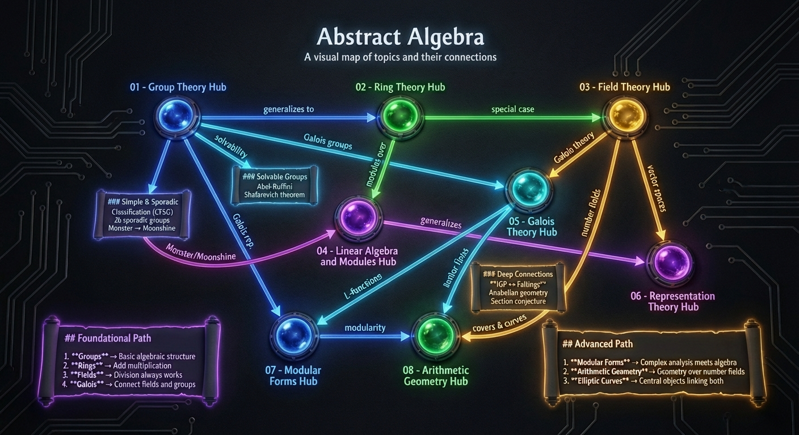

# Abstract Algebra Exercises

An Obsidian vault for studying abstract algebra, featuring exercises, concepts, and visual maps covering the major topics.



## Topics Covered

- **Group Theory** - Groups, subgroups, homomorphisms, quotient groups, Sylow theorems
- **Ring Theory** - Rings, ideals, quotient rings, PIDs, UFDs
- **Field Theory** - Field extensions, algebraic elements, splitting fields
- **Linear Algebra & Modules** - Vector spaces, linear transformations, modules over rings
- **Galois Theory** - Galois groups, fundamental theorem, solvability by radicals
- **Representation Theory** - Group representations, characters, Maschke's theorem, Lie groups, Lie algebras
- **Modular Forms** - Modular group, cusp forms, Hecke operators, L-functions, modularity theorem
- **Arithmetic Geometry** - Elliptic curves, rational points, schemes, BSD conjecture, Galois representations
- **Set Theory and Foundations** - Induction, partial orders, Zorn's lemma, cardinality and infinite sets

## Structure

```
exercise_abstract/
├── 00 - Home/           # Index, trackers, and base files
├── 01 - Group Theory/   # Concepts and exercises
├── 02 - Ring Theory/    # Concepts and exercises
├── 03 - Field Theory/   # Concepts and exercises
├── 04 - Linear Algebra and Modules/  # Concepts and exercises
├── 05 - Galois Theory/  # Concepts and exercises
├── 06 - Representation Theory/  # Concepts and exercises
├── 07 - Modular Forms/  # Concepts and exercises
├── 08 - Arithmetic Geometry/  # Concepts and exercises
├── 09 - Daily Exercise Lists/  # Daily Markdown todo lists
├── 10 - Set Theory and Foundations/  # Concepts and exercises
├── Canvas/              # Visual topic maps
├── Templates/           # Exercise and concept templates
└── Attachments/         # Images and files
```

## Features

### Obsidian Bases
- **Exercise Tracker** - Track progress across all exercises
- **Concept Index** - Browse and search concepts
- **Study Progress** - Filter by difficulty and topic

### JSON Canvas
- **Abstract Algebra Overview** - High-level topic connections
- **Topic Relationships** - Detailed concept hierarchy
- **Study Roadmap** - Suggested learning path

### Templates
- **Exercise Template** - Structured format with hints and solutions
- **Concept Template** - Definitions, examples, and related concepts

## Plugins Used

- **Dataview** - Dynamic queries and progress tracking
- **Templater** - Template insertion
- **LaTeX Suite** - Math typing shortcuts
- **TikZJax** - Commutative diagrams
- **Excalidraw** - Freeform diagrams

## Getting Started

1. Open the vault in Obsidian
2. Start at `00 - Home/Index.md`
3. Follow the study roadmap or explore by topic
4. Use the Exercise Tracker to monitor progress

## Exercise Format

Each exercise includes:
- Problem statement in callout format
- Progressive hints (collapsed by default)
- Full solution (collapsed by default)
- Related concepts and notes
- YAML frontmatter for tracking (status, difficulty, topic, source)

---

## Changelog

[Full change history](CHANGELOG.md)

### 2026-09-29 (Changelog History Separation)

- Reorganized: Preserved the complete change history in `CHANGELOG.md`; README now shows only the latest three entries with a link to the full history. Updated the repository guidelines to keep both files synchronized on future changes.

### 2026-09-29 (Neukirch Exercise Archive Dashboard)

- Added: A Neukirch Algebraic Number Theory archive dashboard modeled on the Lang archive, with seven source-checked chapter titles, dynamic chapter coverage and exercise mappings, source-locator checks, and a Chapter I next-target pointer. Exercise identities include chapter, section, and number because numbering restarts between sections. Full source totals remain explicitly unaudited; no exercise notes or learning states were changed. Linked the dashboard from the home page.

### 2026-09-29 (Lang Archive Completed and Set Theory Foundations)

- Added: All 70 remaining Lang exercises: Chapter XIX (21), XX (30), XXI (5), and Appendix 2 (14), after visual inspection of the original PDF. Appendix 1 has no numbered exercises. The new notes are LA492-LA531, R308-R321, F117-F120, G330, Rep150, and ST1-ST10; all remain `not-started`.
- Added: Nine prerequisite concepts for exterior and Clifford algebras, universal differentials, connections, injective modules, Ext, group cohomology, Koszul complexes, and cardinal arithmetic, with dynamic exercise backlinks and hub entries. Original statements, multipart tasks, hints, and source errors are preserved; independent solutions and imported proof inputs are distinguished.
- Reorganized: With user approval, added Set Theory and Foundations. Artin A.4 and A.8-A.12 moved to ST11-ST16, along with the existing induction and Zorn-lemma concepts. Their mathematical content, source identities, dates, and learning states are unchanged. Updated links, both archive dashboards, the home page, topic templates, and the three topic/learning canvases.
- Clarified: Clifford signs and eigenspaces, group-extension assumptions, cyclic cohomology parity, the degree-zero Tate convention, the nonzero parameter in the Ext formula, the original Koszul hints, and Appendix 2's missing n≥2 hypothesis. The composite Euler-characteristic proof explicitly uses the source's precise Grothendieck-family definition.
- Verified: All 70 new source labels map exactly once. The full Lang edition now has 529 archived numbered exercises with no missing, duplicate, unexpected, or unparsed mappings; Artin's 15 appendix labels remain one-to-one after migration. Mathematical cross-review, metadata, source anchors, links, Obsidian formula syntax, and Study Progress discovery passed checks. Earlier notes retain their recorded proof-status caveats.
