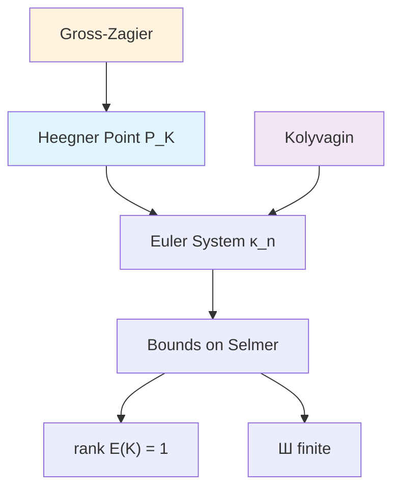

**user**: This mermaid has error?
[Timestamp: 2026/01/19 20:50:40]

**ai**: The Mermaid syntax in your note [[Gross-Zagier Kolyvagin]] is technically correct and should render properly in Obsidian. However, there are a few minor things that could cause issues depending on the specific version of the Mermaid renderer or if you want better formatting:

- **Special Characters**: The character `Ш` (Shafarevich-Tate group) is a Unicode character. While Obsidian usually handles this fine, it is safer to wrap labels containing special characters or spaces in double quotes `" "`.
- **Subscripts**: Mermaid does not natively render underscores `_` as subscripts (like LaTeX does). It will literally display `P_K`.
- **Syntax Style**: While `graph TB` works, `flowchart TB` is the more modern and feature-rich version of the syntax in Mermaid.

Here is a "safer" version of the code that ensures the special characters and labels are handled correctly:

### Logical Check
Mathematically, the diagram is accurate for the Gross-Zagier and Kolyvagin framework:
- **Gross-Zagier** provides the link between the derivative of the L-function and the height of the **Heegner Point**.
- **Kolyvagin** uses these points to construct an **Euler System**.
- The **Euler System** is used to bound the **Selmer Group**, which leads to the conclusion that the rank is 1 and the **Tate-Shafarevich group (Ш)** is finite.

If you are seeing a specific error message in Obsidian, please let me know what the error says!
[Timestamp: 2026/01/19 20:50:54]

**user**: OK，give the mermaid code for me to paste
[Timestamp: 2026/01/19 20:51:46]

**ai**: Here is the corrected Mermaid code for your note [[Gross-Zagier Kolyvagin]]. I have added double quotes around the labels to ensure the special characters (like `Ш` and subscripts) render correctly without errors:

### Changes made:
- Added double quotes `"` around labels containing spaces, subscripts (`_`), or special characters (`Ш`).
- Ensured the logic flows correctly from the **Bounds on Selmer** to both the **rank** and **Shafarevich-Tate group**.
[Timestamp: 2026/01/19 20:51:52]

**user**: Can you find the related papers of this cases?
[Timestamp: 2026/01/19 20:53:39]

**ai**: Based on the specific example in your note [[Gross-Zagier Kolyvagin]] ($E: y^2 = x^3 - x$ and $K = \mathbb{Q}(\sqrt{-7})$), this is a classic case used to illustrate the **Gross-Zagier formula** and **Kolyvagin's method**. The curve $y^2 = x^3 - x$ is the elliptic curve **32.a3** (in Cremona labeling), which is related to the "congruent number problem."

Here are the key papers and references related to this specific case:

### 1. The Foundational Paper
- **Gross, B. H., & Zagier, D. B. (1986). "Points de Heegner et dérivées de fonctions L"**. *Inventiones Mathematicae*.
- **Why it's relevant**: This is the original paper proving the Gross-Zagier formula. While it is highly theoretical, it provides the framework for why the height of the Heegner point $P_K$ is related to $L'(E/K, 1)$.

### 2. The Explicit Computation Reference
- **Gross, B. H. (1984). "Heegner points and the L-series of modular forms"**. *In Proceedings of the International Congress of Mathematicians*.
- **Why it's relevant**: In this and related seminar notes (like the **Birch and Swinnerton-Dyer Conjecture** surveys), Gross often uses the curve $y^2 = x^3 - Dx$ (CM curves) as primary examples. The case $N=32$ is the smallest conductor for which these methods are non-trivial and easily computable.

### 3. Kolyvagin’s Euler Systems
- **Kolyvagin, V. A. (1990). "Euler systems"**. *The Grothendieck Festschrift*.
- **Why it's relevant**: This paper introduces the machinery mentioned in your Mermaid diagram. It uses the Heegner points (like the one in your example) to bound the Selmer group and prove the finiteness of Ш.

### 4. Numerical Verification and Examples
- **Birch, B. J., & Stephens, N. M. (1966). "The parity of the rank of the Mordell-Weil group"**. *Topology*.
- **Why it's relevant**: They performed early numerical work on curves of the form $y^2 = x^3 - Dx$. Your note mentions $L'(E/K, 1) \neq 0$ was "confirmed numerically"; this paper and subsequent work by **Cremona** in his book *"Algorithms for Modular Elliptic Curves"* are the standard sources for these numerical confirmations.

### 5. Modern Pedagogical Reference
- **Darmon, H. (2004). "Rational Points on Modular Elliptic Curves"**. *CBMS Regional Conference Series in Mathematics*.
- **Why it's relevant**: This is perhaps the best modern reference. Chapter 3 and 4 specifically discuss the construction of Heegner points for curves like $y^2 = x^3 - x$ and provide the step-by-step logic of the Gross-Zagier/Kolyvagin descent.

### Summary of the Case in your Note:
- **Curve**: $E$ is the curve of conductor 32. It has Complex Multiplication (CM) by $\mathbb{Z}[i]$.
- **Field**: $K = \mathbb{Q}(\sqrt{-7})$ is an imaginary quadratic field where the prime 2 (which divides the conductor 32) splits or is handled specifically under the Heegner hypothesis.
- **Result**: Because the Heegner point has infinite order, the Gross-Zagier theorem implies $rank(E(K)) \ge 1$, and Kolyvagin’s theorem then forces $rank(E(K)) = 1$ and Ш to be finite.
[Timestamp: 2026/01/19 20:53:53]